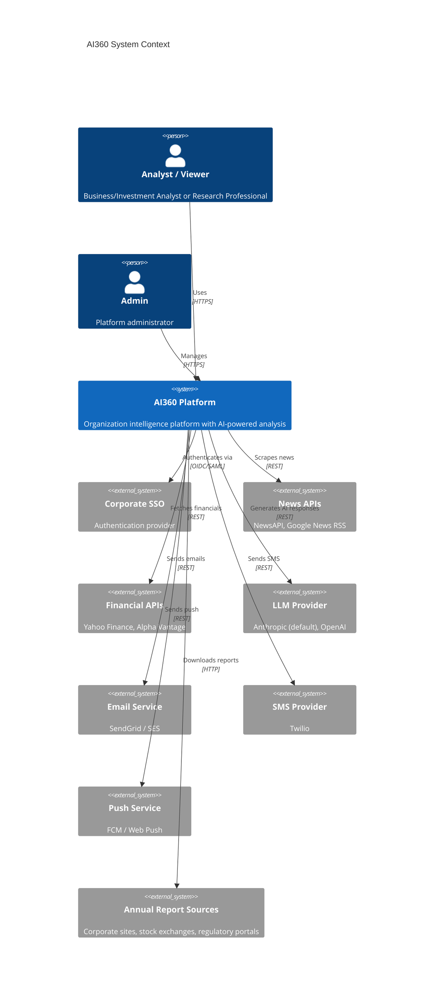
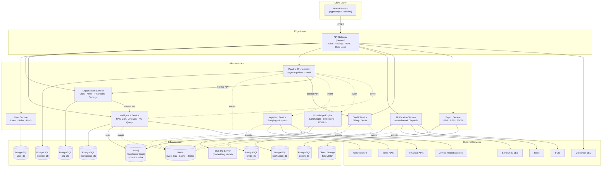
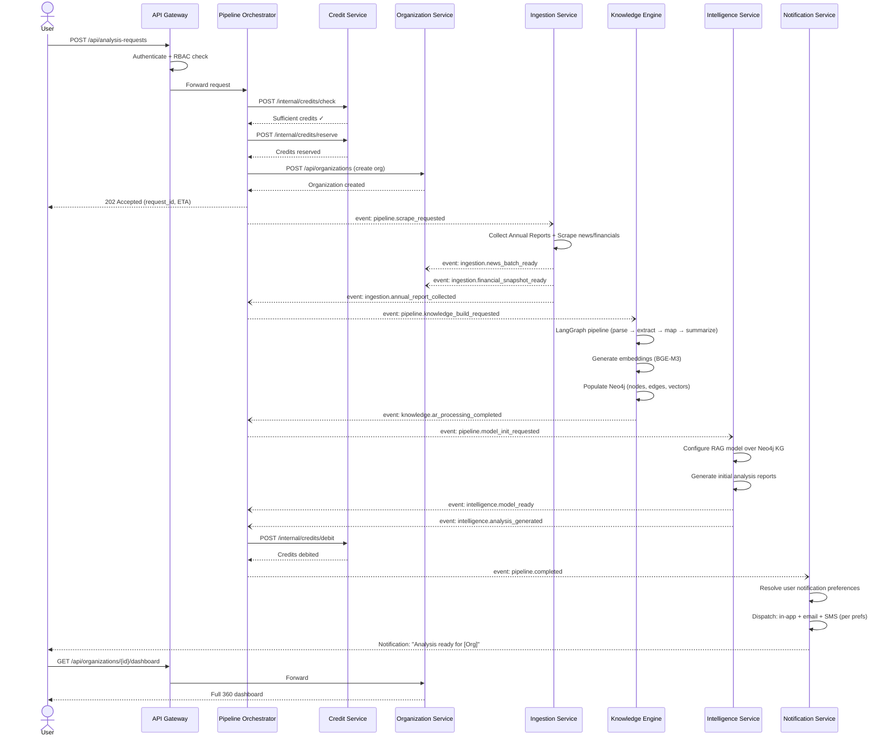
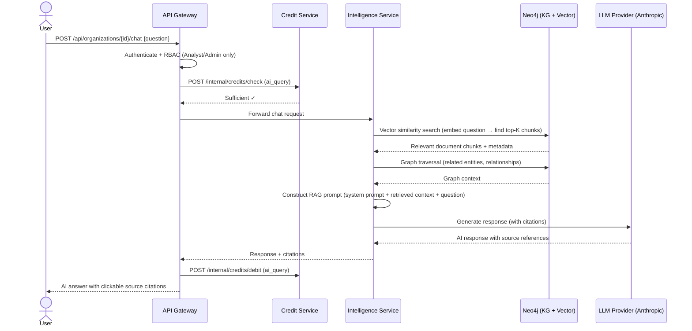
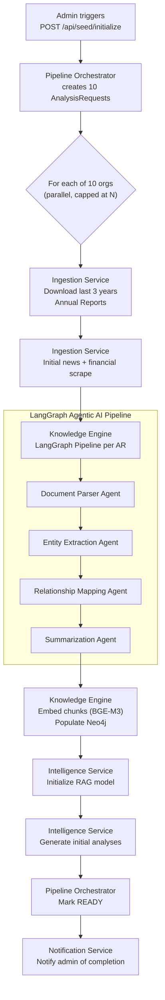
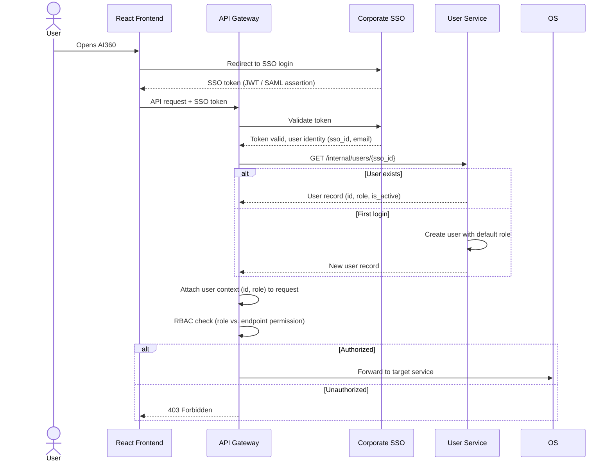

# AI360 — Microservices Solution Architecture

**Version:** 1.0
**Author:** Nitin Agarwal
**Last Updated:** 2026-03-18
**Status:** Draft

---

## Table of Contents

1. [Architecture Overview](#1-architecture-overview)
2. [Design Principles](#2-design-principles)
3. [Service Decomposition](#3-service-decomposition)
4. [Service Details](#4-service-details)
5. [Data Ownership & Storage Strategy](#5-data-ownership--storage-strategy)
6. [Inter-Service Communication](#6-inter-service-communication)
7. [Infrastructure Components](#7-infrastructure-components)
8. [Architecture Diagrams](#8-architecture-diagrams)
9. [Deployment Topology](#9-deployment-topology)
10. [Cross-Cutting Concerns](#10-cross-cutting-concerns)
11. [API Gateway & Routing](#11-api-gateway--routing)
12. [Event Catalog](#12-event-catalog)
13. [Failure Handling & Resilience](#13-failure-handling--resilience)
14. [Security Architecture](#14-security-architecture)
15. [Scalability Considerations](#15-scalability-considerations)
16. [API Specification (OpenAPI 3.1)](#16-api-specification-openapi-31)
17. [Open Architecture Decisions](#17-open-architecture-decisions)

---

## 1. Architecture Overview

AI360 is decomposed into **10 microservices** organized around bounded contexts. Each service owns its domain data, exposes a well-defined API, and communicates with other services via synchronous REST calls (query path) or asynchronous events (command/pipeline path).

A single **API Gateway** serves as the entry point for all client traffic, handling authentication, routing, rate limiting, and RBAC enforcement before forwarding requests to the appropriate service.

**High-Level Service Map:**

| # | Service | Bounded Context | Primary Responsibility |
|---|---------|-----------------|----------------------|
| 1 | API Gateway | Edge | Authentication, routing, rate limiting, RBAC |
| 2 | User Service | Identity & Access | User management, RBAC, SSO, audit log |
| 3 | Organization Service | Organization Domain | Org CRUD, search, dashboard aggregation |
| 4 | Ingestion Service | Data Collection | Web scraping, news/financial API adapters, Annual Report collection |
| 5 | Knowledge Engine | AI Processing | LangGraph pipeline, entity extraction, KG population, embedding generation |
| 6 | Intelligence Service | AI Querying | RAG-based Q&A, analysis generation, per-org AI model serving |
| 7 | Notification Service | Messaging | Multi-channel dispatch (in-app, email, SMS, push), quiet hours |
| 8 | Credit Service | Billing | Credit accounts, transactions, quota, pricing |
| 9 | Export Service | Reporting | PDF/CSV/JSON report generation |
| 10 | Pipeline Orchestrator | Workflow | Async analysis pipelines, seed pipeline, status tracking |

---

## 2. Design Principles

1. **Single Responsibility** — Each service owns one bounded context. No service reaches into another service's database.
2. **Data Sovereignty** — Each service owns and manages its own data store. Cross-service data access happens only through APIs or events.
3. **Async by Default for Pipelines** — All long-running operations (scraping, knowledge base building, report generation) are asynchronous. The user submits a request and is notified on completion.
4. **Provider Agnosticism** — LLM, embedding model, and data source integrations are behind abstraction layers. Swapping providers requires configuration changes, not code changes.
5. **Event-Driven Coordination** — Services coordinate via an event bus (Redis Streams) for pipeline orchestration. Direct synchronous calls are reserved for query-time reads.
6. **Graceful Degradation** — If a non-critical service is unavailable (e.g., Notification Service), the core workflow continues and retries delivery later.
7. **Configuration over Code** — Scraping frequency, LLM provider, embedding model, data sources, credit pricing, and notification channels are all runtime-configurable.
8. **Defense in Depth** — Authentication at the gateway, authorization (RBAC) at the service level, input validation at every boundary.

---

## 3. Service Decomposition

```
┌─────────────────────────────────────────────────────────────────────┐
│                          CLIENT (React/TS)                          │
└──────────────────────────────┬──────────────────────────────────────┘
                               │ HTTPS
                               ▼
┌─────────────────────────────────────────────────────────────────────┐
│                         API GATEWAY                                 │
│            (Auth, Routing, Rate Limiting, RBAC)                     │
└──────┬────────┬────────┬────────┬────────┬────────┬────────┬───────┘
       │        │        │        │        │        │        │
       ▼        ▼        ▼        ▼        ▼        ▼        ▼
  ┌────────┐┌───────┐┌───────┐┌────────┐┌───────┐┌───────┐┌───────┐
  │ User   ││ Org   ││Intell.││Pipeline││Notif. ││Credit ││Export │
  │Service ││Service││Service││Orch.   ││Service││Service││Service│
  └───┬────┘└───┬───┘└───┬───┘└───┬────┘└───┬───┘└───┬───┘└───┬───┘
      │         │        │        │         │        │        │
      │         │        │    ┌───┴───┐     │        │        │
      │         │        │    ▼       ▼     │        │        │
      │         │        │┌───────┐┌──────┐ │        │        │
      │         │        ││Ingest.││Know. │ │        │        │
      │         │        ││Service││Engine│ │        │        │
      │         │        │└───────┘└──────┘ │        │        │
      ▼         ▼        ▼                  ▼        ▼        ▼
  ┌────────┐┌───────┐┌───────┐         ┌───────┐┌───────┐┌───────┐
  │Postgre-││Postgre-││Neo4j  │         │Postgre-││Postgre-││Object │
  │SQL(usr)││SQL(org)││+ Vec  │         │SQL(ntf)││SQL(crd)││Storage│
  └────────┘└───────┘└───────┘         └───────┘└───────┘└───────┘
```

---

## 4. Service Details

### 4.1 API Gateway

**Technology:** FastAPI (or Kong/Traefik if an off-the-shelf gateway is preferred)

**Responsibilities:**
- TLS termination
- Corporate SSO authentication (validates SSO tokens, extracts user identity)
- RBAC enforcement: resolves the user's role from User Service and attaches it to the request context; rejects unauthorized requests with 403
- Request routing to downstream services based on URL prefix
- Rate limiting (per-user, per-IP)
- Request/response logging for audit
- CORS configuration for the React frontend

**Routes:**

| URL Prefix | Target Service |
|------------|---------------|
| `/api/me`, `/api/admin/users`, `/api/admin/audit-log` | User Service |
| `/api/organizations`, `/api/search`, `/api/compare` | Organization Service |
| `/api/organizations/{id}/graph`, `/api/organizations/{id}/model` | Intelligence Service |
| `/api/analysis-requests`, `/api/seed` | Pipeline Orchestrator |
| `/api/organizations/{id}/analysis`, `/api/organizations/{id}/chat` | Intelligence Service |
| `/api/notifications`, `/api/me/notification-preferences` | Notification Service |
| `/api/me/credits`, `/api/admin/credits` | Credit Service |
| `/api/admin/settings`, `/api/admin/data-sources` | Organization Service |
| `/api/export` | Export Service |
| `/api/organizations/{id}/annual-reports` | Organization Service |

---

### 4.2 User Service

**Technology:** FastAPI + PostgreSQL

**Owns:** `User`, `RoleChangeAuditLog`, `NotificationPreferences`

**Responsibilities:**
- User lifecycle: creation on first SSO login, profile retrieval, deactivation
- Role assignment and management (Admin, Analyst, Viewer)
- Default role assignment from PlatformSettings (queried from Organization Service)
- Role change audit logging
- Notification preferences CRUD per user
- `GET /api/me` — returns the current user's profile, role, and permissions

**Exposed API:**

| Method | Endpoint | Description |
|--------|----------|-------------|
| GET | /internal/users/{sso_id} | (Internal) Resolve user by SSO ID |
| GET | /api/me | Current user's profile and role |
| GET | /api/admin/users | List all users |
| GET | /api/admin/users/{id} | User details |
| PATCH | /api/admin/users/{id}/role | Change user role |
| GET | /api/admin/audit-log/roles | Role change audit log |
| GET | /api/me/notification-preferences | Get notification prefs |
| PUT | /api/me/notification-preferences | Update notification prefs |

**Internal Events Consumed:**
- None (stateless queries)

**Internal Events Published:**
- `user.role_changed` — consumed by services that cache user roles

---

### 4.3 Organization Service

**Technology:** FastAPI + PostgreSQL

**Owns:** `Organization`, `PlatformSettings`, `DataSourceConfig`, `NewsArticle`, `FinancialSnapshot`, `AnnualReport`

**Responsibilities:**
- Organization CRUD (add, update, activate/deactivate)
- Organization search (by name, ticker — with fuzzy matching via PostgreSQL `pg_trgm`)
- Dashboard data aggregation: combines org metadata, latest financial snapshot, latest news summary, knowledge base health (queried from Intelligence Service), and AI model status
- Annual Report metadata management (CRUD, processing status tracking)
- News article storage and querying (with filtering by date, source, sentiment)
- Financial snapshot storage and querying
- Platform settings management (LLM provider, embedding model, default scraping frequency, default user role)
- Data source configuration management (CRUD for `DataSourceConfig`)
- Scraping frequency management per organization
- News article retention enforcement (delegates to a Celery beat job that archives/purges expired articles)

**Exposed API:**

| Method | Endpoint | Description |
|--------|----------|-------------|
| GET | /api/organizations | List organizations |
| GET | /api/organizations/{id} | Org details |
| POST | /api/organizations | (Admin) Create org |
| PUT | /api/organizations/{id} | (Admin) Update org |
| PATCH | /api/organizations/{id}/activate | (Admin) Toggle active |
| GET | /api/organizations/{id}/dashboard | Aggregated dashboard |
| GET | /api/organizations/{id}/news | News articles |
| GET | /api/organizations/{id}/financials | Financial history |
| GET | /api/organizations/{id}/annual-reports | Annual Reports |
| POST | /api/organizations/{id}/annual-reports | (Admin) Upload AR |
| GET | /api/search?q=term | Search organizations |
| GET | /api/compare?ids=... | Multi-org comparison |
| PATCH | /api/organizations/{id}/scraping-frequency | (Admin) Set frequency |
| GET | /api/admin/settings | Platform settings |
| PUT | /api/admin/settings | Update settings |
| GET | /api/admin/data-sources | List data sources |
| POST | /api/admin/data-sources | Add data source |
| PUT | /api/admin/data-sources/{id} | Update data source |
| PATCH | /api/admin/data-sources/{id}/enable | Toggle data source |
| DELETE | /api/admin/data-sources/{id} | Remove data source |

**Internal API (service-to-service):**

| Method | Endpoint | Description |
|--------|----------|-------------|
| GET | /internal/organizations/{id} | Org details for other services |
| GET | /internal/settings | Platform settings for other services |
| GET | /internal/data-sources?type=financial&enabled=true | Active data sources |
| POST | /internal/organizations/{id}/news | Bulk insert news articles |
| POST | /internal/organizations/{id}/financials | Insert financial snapshot |
| PATCH | /internal/organizations/{id}/annual-reports/{id}/status | Update AR processing status |

**Events Published:**
- `organization.created` — triggers pipeline orchestration
- `organization.activated` / `organization.deactivated` — starts/stops scraping schedules
- `settings.updated` — broadcasts config changes to all services

**Events Consumed:**
- `pipeline.stage_completed` — updates AR processing status
- `ingestion.news_batch_ready` — bulk inserts news articles
- `ingestion.financial_snapshot_ready` — inserts financial snapshots

---

### 4.4 Ingestion Service

**Technology:** FastAPI + Celery workers

**Owns:** No persistent store (writes to Organization Service via internal API and publishes events to Knowledge Engine)

**Responsibilities:**
- Web scraping orchestration (news and financial data)
- Data source adapter management: loads adapter classes from `DataSourceConfig`, queries APIs in priority order, merges and deduplicates results
- Annual Report collection: downloads PDFs/HTML filings from corporate websites, stock exchanges, regulatory portals
- Scraping schedule management: Celery beat schedules driven by per-org `scraping_frequency` from Organization Service
- robots.txt compliance checking before scraping
- Article deduplication by source URL
- Passes collected raw data to Knowledge Engine for processing or directly to Organization Service for storage

**Adapter Interface:**

```python
class DataSourceAdapter(ABC):
    @abstractmethod
    async def fetch_financial_data(self, org: Organization) -> FinancialSnapshot: ...

    @abstractmethod
    async def fetch_news(self, org: Organization, since: datetime) -> list[RawArticle]: ...

    @abstractmethod
    def health_check(self) -> bool: ...
```

Built-in adapters: `YahooFinanceAdapter`, `AlphaVantageAdapter`, `NewsAPIAdapter`, `GoogleNewsRSSAdapter`

**Events Published:**
- `ingestion.news_batch_ready` — batch of deduplicated articles ready for storage and NLP
- `ingestion.financial_snapshot_ready` — financial data fetched
- `ingestion.annual_report_collected` — PDF downloaded and ready for processing

**Events Consumed:**
- `organization.created` — starts initial scraping for a new org
- `organization.activated` — resumes scraping schedule
- `organization.deactivated` — pauses scraping schedule
- `pipeline.scrape_requested` — on-demand scraping from Pipeline Orchestrator
- `settings.updated` — reloads data source configs and adapter registry

---

### 4.5 Knowledge Engine

**Technology:** FastAPI + Celery workers + LangGraph + Neo4j

**Owns:** `KnowledgeGraphNode`, `KnowledgeGraphEdge`, `DocumentChunk` (all in Neo4j)

**Responsibilities:**
- LangGraph Agentic AI pipeline for Annual Report processing:
  - **Document Parser Agent** — PDF/HTML → structured text, tables, charts
  - **Entity Extraction Agent** — identifies people, products, financials, strategies, risks
  - **Relationship Mapping Agent** — discovers entity-to-entity connections
  - **Summarization Agent** — produces section-level structured summaries
- Entity extraction from news articles (lighter pipeline than Annual Reports)
- Vector embedding generation via provider-agnostic embedding interface (default: self-hosted BGE-M3)
- Knowledge graph population in Neo4j (nodes, edges, properties)
- Document chunking and embedding storage in Neo4j vector index
- Knowledge base health reporting (node count, edge count, last updated, embedding count)

**Embedding Interface:**

```python
class EmbeddingProvider(ABC):
    @abstractmethod
    async def embed(self, texts: list[str]) -> list[list[float]]: ...

    @abstractmethod
    def dimensions(self) -> int: ...
```

Implementations: `BGEM3Provider` (default), `OpenAIEmbeddingProvider`, `CohereEmbeddingProvider`, `SentenceTransformersProvider`

**Internal API (service-to-service):**

| Method | Endpoint | Description |
|--------|----------|-------------|
| GET | /internal/organizations/{id}/kg/stats | KG health (node/edge/embedding counts) |
| GET | /internal/organizations/{id}/kg/nodes | Query KG nodes (with filters) |
| GET | /internal/organizations/{id}/kg/search | Semantic search over embeddings |
| POST | /internal/process/annual-report | Trigger AR processing pipeline |
| POST | /internal/process/news-batch | Process a batch of news articles (entity extraction + embedding) |

**Events Published:**
- `knowledge.ar_processing_completed` — Annual Report fully processed and indexed
- `knowledge.ar_processing_failed` — pipeline failure with reason
- `knowledge.enrichment_completed` — incremental news/financial enrichment done

**Events Consumed:**
- `ingestion.annual_report_collected` — triggers LangGraph pipeline
- `ingestion.news_batch_ready` — triggers entity extraction + embedding for news
- `pipeline.knowledge_build_requested` — on-demand KG build from orchestrator
- `settings.updated` — reloads embedding model configuration

---

### 4.6 Intelligence Service

**Technology:** FastAPI + Neo4j (read) + LLM abstraction layer

**Owns:** `OrganizationAIModel`, `AnalysisReport` (in PostgreSQL); reads from Neo4j (owned by Knowledge Engine)

**Responsibilities:**
- Per-organization AI model management (RAG configuration, status tracking)
- Conversational AI Q&A: receives a user question, retrieves relevant document chunks and graph context via vector similarity search in Neo4j, constructs a RAG prompt, calls the LLM, returns a grounded answer with source citations
- Analysis report generation: growth trajectory, sentiment summary, competitive landscape
- On-demand analysis refresh
- Knowledge graph querying for the frontend (node/edge traversal, graph visualization data)
- Multi-org comparison with AI-generated competitive insights

**LLM Interface:**

```python
class LLMProvider(ABC):
    @abstractmethod
    async def generate(self, messages: list[Message], **kwargs) -> LLMResponse: ...

    @abstractmethod
    async def stream(self, messages: list[Message], **kwargs) -> AsyncIterator[str]: ...
```

Implementations: `AnthropicProvider` (default), `OpenAIProvider`, `SelfHostedProvider`

**Exposed API:**

| Method | Endpoint | Description |
|--------|----------|-------------|
| GET | /api/organizations/{id}/analysis | Latest analysis reports |
| POST | /api/organizations/{id}/analysis/refresh | Trigger refresh |
| GET | /api/organizations/{id}/graph | KG visualization data |
| GET | /api/organizations/{id}/graph/node/{nid} | Node detail |
| GET | /api/organizations/{id}/model | AI model status |
| POST | /api/organizations/{id}/chat | Conversational AI Q&A |

**Internal API:**

| Method | Endpoint | Description |
|--------|----------|-------------|
| POST | /internal/organizations/{id}/model/initialize | Initialize AI model for an org |
| POST | /internal/organizations/{id}/analysis/generate | Generate analysis reports |
| GET | /internal/organizations/{id}/model/status | Model readiness check |

**Events Published:**
- `intelligence.model_ready` — AI model initialized and ready for queries
- `intelligence.model_failed` — model initialization failed
- `intelligence.analysis_generated` — analysis reports generated

**Events Consumed:**
- `knowledge.ar_processing_completed` — triggers model initialization/update
- `knowledge.enrichment_completed` — triggers analysis regeneration
- `pipeline.model_init_requested` — on-demand model setup from orchestrator
- `settings.updated` — reloads LLM provider configuration

---

### 4.7 Notification Service

**Technology:** FastAPI + Celery workers + PostgreSQL

**Owns:** `Notification` (in PostgreSQL; reads `NotificationPreferences` from User Service)

**Responsibilities:**
- Notification creation and storage (in-app)
- Multi-channel dispatch: email (SendGrid/SES), SMS (Twilio), push (FCM/Web Push)
- Channel selection based on user's `NotificationPreferences` and notification type
- Quiet hours enforcement: queues non-critical notifications and dispatches when quiet hours end
- Delivery status tracking per channel
- Notification listing and read marking for the frontend
- Retry logic for failed channel deliveries (exponential backoff)

**Channel Dispatcher Interface:**

```python
class NotificationChannel(ABC):
    @abstractmethod
    async def send(self, recipient: str, title: str, body: str, link: str | None) -> DeliveryResult: ...
```

Implementations: `InAppChannel`, `EmailChannel` (SendGrid/SES), `SMSChannel` (Twilio), `PushChannel` (FCM)

**Exposed API:**

| Method | Endpoint | Description |
|--------|----------|-------------|
| GET | /api/notifications | User's notifications |
| PATCH | /api/notifications/{id}/read | Mark as read |

**Internal API:**

| Method | Endpoint | Description |
|--------|----------|-------------|
| POST | /internal/notifications/send | Create and dispatch a notification |
| POST | /internal/notifications/send-batch | Batch dispatch |

**Events Consumed:**
- `pipeline.completed` — sends analysis_ready notification
- `pipeline.failed` — sends analysis_failed notification
- `export.ready` — sends export_ready notification
- `credit.low` — sends credit_low notification
- `credit.quota_reached` — sends quota_reached notification

---

### 4.8 Credit Service

**Technology:** FastAPI + PostgreSQL

**Owns:** `CreditAccount`, `CreditTransaction`, `CreditPricing`

**Responsibilities:**
- Credit account management per user (balance, quota, billing cycle)
- Credit balance and quota checks before billable actions (check-and-reserve pattern with DB-level locking)
- Credit debiting on action execution
- Credit refunding on action failure
- Quota usage tracking and reset on billing cycle rollover
- Transaction history
- Admin credit adjustments (add/deduct)
- Admin pricing management
- Low-credit threshold monitoring

**Exposed API:**

| Method | Endpoint | Description |
|--------|----------|-------------|
| GET | /api/me/credits | Balance, quota, billing cycle |
| GET | /api/me/credits/transactions | Transaction history |
| PATCH | /api/me/credits/quota | Update quota limit |
| PATCH | /api/me/credits/low-threshold | Set low-credit threshold |
| GET | /api/admin/credits/pricing | List pricing |
| PUT | /api/admin/credits/pricing/{id} | Update pricing |
| POST | /api/admin/credits/adjust/{user_id} | Credit adjustment |

**Internal API:**

| Method | Endpoint | Description |
|--------|----------|-------------|
| POST | /internal/credits/check | Check if user has sufficient credits and quota |
| POST | /internal/credits/reserve | Reserve credits for an action |
| POST | /internal/credits/debit | Confirm debit after action completes |
| POST | /internal/credits/release | Release reserved credits (action cancelled/failed) |

**Events Published:**
- `credit.low` — balance dropped below threshold
- `credit.quota_reached` — billing cycle quota exhausted
- `credit.reserved` — credits reserved for a billable action

**Events Consumed:**
- `pipeline.completed` — confirms credit debit for analysis request
- `pipeline.failed` — releases reserved credits
- `export.completed` — confirms credit debit for export
- `intelligence.chat_query_completed` — debits for AI Q&A query

---

### 4.9 Export Service

**Technology:** FastAPI + Celery workers + Object Storage (S3/MinIO)

**Owns:** `ExportJob` (in PostgreSQL), generated files (in Object Storage)

**Responsibilities:**
- PDF report generation (organization 360 profile, comparison reports)
- CSV/JSON structured data export
- Section selection (user chooses which sections to include)
- Async generation for large reports with progress tracking
- File storage in object storage with time-limited download URLs
- Credit check before starting export (delegates to Credit Service)

**Exposed API:**

| Method | Endpoint | Description |
|--------|----------|-------------|
| POST | /api/export | Start an export job |
| GET | /api/export/{id} | Export job status |
| GET | /api/export/{id}/download | Download generated file |
| GET | /api/export | List user's export jobs |

**Events Published:**
- `export.ready` — file generated and ready for download
- `export.failed` — generation failed
- `export.completed` — confirms export completed (for credit debit)

**Events Consumed:**
- None (triggered via API by Pipeline Orchestrator or directly by user)

---

### 4.10 Pipeline Orchestrator

**Technology:** FastAPI + Celery workers + PostgreSQL

**Owns:** `AnalysisRequest` (in PostgreSQL)

**Responsibilities:**
- Manages the end-to-end async analysis pipeline for new organization onboarding
- Manages the seed data pipeline (batch processing of 10 seed orgs)
- Pipeline stages: validate → check credits → create org → collect Annual Reports → scrape news/financials → build knowledge base → initialize AI model → generate analysis → notify user
- Stage-by-stage status tracking with timestamps
- Pipeline failure handling and retry logic
- Request deduplication (prevents duplicate pipelines for the same org)
- Request cancellation
- Concurrency management (limits parallel pipelines)

**Pipeline State Machine:**

```
QUEUED → CREDIT_CHECK → CREATING_ORG → COLLECTING_REPORTS → SCRAPING
  → BUILDING_KNOWLEDGE_BASE → INITIALIZING_MODEL → GENERATING_ANALYSIS
  → READY
  
  (any stage) → FAILED → (retry) → QUEUED
  (any stage) → CANCELLED
```

**Exposed API:**

| Method | Endpoint | Description |
|--------|----------|-------------|
| POST | /api/analysis-requests | Submit analysis request |
| GET | /api/analysis-requests | List user's requests |
| GET | /api/analysis-requests/{id} | Request details + stage |
| DELETE | /api/analysis-requests/{id} | Cancel pending request |
| POST | /api/seed/initialize | (Admin) Trigger seed pipeline |
| GET | /api/seed/status | (Admin) Seed pipeline progress |

**Events Published:**
- `pipeline.scrape_requested` — tells Ingestion Service to start scraping
- `pipeline.knowledge_build_requested` — tells Knowledge Engine to build KG
- `pipeline.model_init_requested` — tells Intelligence Service to init model
- `pipeline.stage_completed` — broadcast after each stage completes
- `pipeline.completed` — full pipeline done (triggers notification + credit debit)
- `pipeline.failed` — pipeline failure (triggers notification + credit release)

**Events Consumed:**
- `organization.created` — optional auto-pipeline trigger
- `ingestion.annual_report_collected` — marks collection stage complete
- `ingestion.news_batch_ready` — marks scraping stage complete
- `knowledge.ar_processing_completed` — marks KG build stage complete
- `knowledge.ar_processing_failed` — triggers pipeline failure
- `intelligence.model_ready` — marks model init stage complete
- `intelligence.model_failed` — triggers pipeline failure
- `intelligence.analysis_generated` — marks analysis stage complete
- `credit.reserved` — confirms credit check passed

---

## 5. Data Ownership & Storage Strategy

### 5.1 Database-per-Service

Each service owns its database schema. No service directly queries another service's database.

| Service | Database | Schema / Store | Key Tables |
|---------|----------|---------------|------------|
| User Service | PostgreSQL | `user_db` | User, RoleChangeAuditLog, NotificationPreferences |
| Organization Service | PostgreSQL | `org_db` | Organization, PlatformSettings, DataSourceConfig, NewsArticle, FinancialSnapshot, AnnualReport |
| Knowledge Engine | Neo4j | graph + vector index | KnowledgeGraphNode, KnowledgeGraphEdge, DocumentChunk |
| Intelligence Service | PostgreSQL | `intelligence_db` | OrganizationAIModel, AnalysisReport |
| Notification Service | PostgreSQL | `notification_db` | Notification |
| Credit Service | PostgreSQL | `credit_db` | CreditAccount, CreditTransaction, CreditPricing |
| Export Service | PostgreSQL + Object Storage | `export_db` + S3/MinIO | ExportJob, generated files |
| Pipeline Orchestrator | PostgreSQL | `pipeline_db` | AnalysisRequest |

### 5.2 Shared Reads via Internal APIs

Some services need data from other services' domains. These are handled via internal REST APIs (never direct DB access):

| Consumer | Provider | Data Needed | Mechanism |
|----------|----------|-------------|-----------|
| API Gateway | User Service | User role for RBAC | `GET /internal/users/{sso_id}` (cached in gateway, TTL 5 min) |
| Organization Service | Intelligence Service | KG health stats | `GET /internal/organizations/{id}/kg/stats` |
| Organization Service | Intelligence Service | AI model status | `GET /internal/organizations/{id}/model/status` |
| Intelligence Service | Knowledge Engine | KG nodes, edges, vector search | `GET /internal/organizations/{id}/kg/*` |
| Notification Service | User Service | Notification preferences | `GET /internal/users/{id}/notification-preferences` (cached) |
| Pipeline Orchestrator | Credit Service | Credit check + reserve | `POST /internal/credits/check`, `POST /internal/credits/reserve` |
| Pipeline Orchestrator | Organization Service | Org data, settings | `GET /internal/organizations/{id}`, `GET /internal/settings` |
| Export Service | Organization Service | Org data, news, financials | Internal API calls |
| Export Service | Intelligence Service | Analysis reports, KG data | Internal API calls |

### 5.3 Retention Strategy

| Data Type | Owner | Retention | Mechanism |
|-----------|-------|-----------|-----------|
| News articles | Organization Service | 7 years from publication | Celery beat job archives/purges expired records |
| Financial snapshots | Organization Service | Indefinite | Never deleted |
| Annual Reports | Organization Service | Indefinite | Never deleted |
| Knowledge graph (nodes/edges) | Knowledge Engine | Indefinite | Never deleted |
| Document chunks + embeddings | Knowledge Engine | Indefinite (except news-sourced chunks after 7 years) | Celery beat job cleans up news-sourced chunks on archival |
| Analysis reports | Intelligence Service | Indefinite | Never deleted |
| Credit transactions | Credit Service | Indefinite (compliance) | Never deleted |
| Audit logs | User Service | Indefinite (compliance) | Never deleted |
| Notifications | Notification Service | 1 year (configurable) | Archival job |
| Export files | Export Service | 30 days (configurable) | Cleanup job deletes from object storage |

---

## 6. Inter-Service Communication

### 6.1 Communication Patterns

| Pattern | Use Case | Technology |
|---------|----------|------------|
| **Synchronous REST** | Query-time reads (dashboard, search, chat Q&A) | HTTP/JSON via internal APIs |
| **Asynchronous Events** | Pipeline orchestration, notifications, credit events | Redis Streams (event bus) |
| **Task Queue** | Long-running jobs (scraping, KG building, report generation) | Celery + Redis broker |
| **WebSocket** | Real-time status updates to frontend (request tracking) | FastAPI WebSocket via API Gateway |

### 6.2 Event Bus

**Technology:** Redis Streams

Redis Streams provides a persistent, ordered, consumer-group-based event log. Each event has a type, payload, and metadata.

**Event Envelope:**

```json
{
  "event_id": "uuid",
  "event_type": "pipeline.completed",
  "timestamp": "2026-03-18T10:30:00Z",
  "source_service": "pipeline_orchestrator",
  "payload": {
    "analysis_request_id": "uuid",
    "organization_id": "uuid",
    "user_id": "uuid"
  },
  "correlation_id": "uuid"
}
```

**Consumer Groups:** Each service runs a consumer group so events are load-balanced across instances and not lost if a consumer is temporarily down.

### 6.3 Internal API Authentication

Internal service-to-service calls use a shared secret (JWT signed with a cluster-internal key). The API Gateway does not proxy internal calls — services communicate directly within the cluster network.

---

## 7. Infrastructure Components

| Component | Technology | Purpose |
|-----------|------------|---------|
| **Relational DB** | PostgreSQL 16 | User, org, notification, credit, pipeline, export metadata |
| **Graph DB + Vector Store** | Neo4j 5.x (with vector index) | Knowledge graph, document chunks, embeddings |
| **Message Broker** | Redis 7.x (Streams + Pub/Sub) | Event bus, Celery broker, caching |
| **Task Queue** | Celery 5.x | Distributed background workers for scraping, KG building, exports |
| **Object Storage** | S3 / MinIO | Annual Report PDFs, generated export files |
| **Embedding Model Server** | Self-hosted BGE-M3 (via FastAPI wrapper or TEI) | Vector embedding generation |
| **LLM Provider** | Anthropic API (default) | RAG responses, analysis generation |
| **Email Delivery** | SendGrid / AWS SES | Email notifications |
| **SMS Delivery** | Twilio | SMS notifications |
| **Push Notifications** | Firebase Cloud Messaging / Web Push API | Browser push notifications |
| **Container Runtime** | Docker + Kubernetes | Service deployment, scaling, health checks |
| **Service Mesh** | Istio (optional) | mTLS, observability, traffic management |
| **Monitoring** | Prometheus + Grafana | Metrics, dashboards, alerting |
| **Logging** | ELK Stack (Elasticsearch + Logstash + Kibana) | Centralized logging |
| **Tracing** | OpenTelemetry + Jaeger | Distributed tracing across services |

---

## 8. Architecture Diagrams

### 8.1 System Context Diagram



### 8.2 Container Diagram (Service Interactions)



### 8.3 Pipeline Sequence (Async Analysis Request)



### 8.4 RAG Query Flow (Conversational AI)



### 8.5 Seed Data Pipeline



---

## 9. Deployment Topology

### 9.1 Kubernetes Namespace Layout

```
ai360-platform/
├── ai360-gateway          (Deployment: 2 replicas)
├── ai360-user-svc         (Deployment: 2 replicas)
├── ai360-org-svc           (Deployment: 2 replicas)
├── ai360-intelligence-svc  (Deployment: 2 replicas)
├── ai360-pipeline-svc      (Deployment: 2 replicas)
├── ai360-ingestion-svc     (Deployment: 2 replicas)
├── ai360-ingestion-worker  (Deployment: 3 replicas, Celery workers)
├── ai360-knowledge-svc     (Deployment: 2 replicas)
├── ai360-knowledge-worker  (Deployment: 3 replicas, Celery workers, GPU-enabled for BGE-M3)
├── ai360-notification-svc  (Deployment: 2 replicas)
├── ai360-notification-worker (Deployment: 2 replicas, Celery workers)
├── ai360-credit-svc        (Deployment: 2 replicas)
├── ai360-export-svc        (Deployment: 2 replicas)
├── ai360-export-worker     (Deployment: 2 replicas, Celery workers)
├── ai360-frontend          (Deployment: 2 replicas, Nginx serving React build)
├── ai360-embedding-server  (Deployment: 2 replicas, GPU-enabled, serves BGE-M3)
├── ai360-celery-beat       (Deployment: 1 replica, scheduler)
├── postgresql              (StatefulSet or managed: AWS RDS / Azure Flexible Server)
├── neo4j                   (StatefulSet or managed: Neo4j AuraDB)
├── redis                   (StatefulSet or managed: AWS ElastiCache)
└── minio                   (StatefulSet, or use cloud S3)
```

### 9.2 Scaling Strategy

| Service | Scaling Dimension | Strategy |
|---------|-------------------|----------|
| API Gateway | Request throughput | Horizontal (add replicas behind load balancer) |
| Ingestion Workers | Number of orgs × scraping frequency | Horizontal (add Celery workers) |
| Knowledge Workers | Pipeline queue depth | Horizontal + vertical (GPU nodes for embedding) |
| Intelligence Service | Query concurrency | Horizontal (stateless, LLM calls are the bottleneck) |
| Embedding Server | Embedding throughput | Vertical (GPU) + horizontal (multiple replicas) |
| Neo4j | Graph size, query concurrency | Vertical + read replicas (Neo4j clustering) |
| PostgreSQL | Transaction volume | Vertical + read replicas per service DB |
| Redis | Event throughput | Redis Cluster for sharding |

---

## 10. Cross-Cutting Concerns

### 10.1 Observability

| Concern | Tool | Details |
|---------|------|---------|
| **Metrics** | Prometheus + Grafana | Each service exposes `/metrics`. Key metrics: request latency, error rate, queue depth, credit balance distribution, pipeline completion time |
| **Logging** | ELK Stack | Structured JSON logging. Each log entry includes `correlation_id`, `service_name`, `user_id`. All services log to stdout, collected by Fluentd/Logstash |
| **Tracing** | OpenTelemetry + Jaeger | Distributed traces across service boundaries. `correlation_id` propagated via HTTP headers and event metadata |
| **Alerting** | Grafana Alerting / PagerDuty | Alerts on: error rate spikes, pipeline failures, queue depth > threshold, credit service latency, Neo4j connection failures |

### 10.2 Health Checks

Every service exposes:
- `GET /health/live` — process is running (Kubernetes liveness probe)
- `GET /health/ready` — service can handle requests, dependencies are reachable (Kubernetes readiness probe)

### 10.3 Configuration Management

| Config Type | Mechanism | Examples |
|-------------|-----------|---------|
| Service config | Environment variables + ConfigMaps | Database URLs, Redis URL, service discovery |
| Secrets | Kubernetes Secrets / Vault | API keys (Anthropic, Twilio, SendGrid), SSO credentials, DB passwords |
| Runtime config | PlatformSettings table (Organization Service) | LLM provider, embedding model, default scraping frequency, default user role |
| Data source config | DataSourceConfig table (Organization Service) | API adapters, base URLs, priority order |

### 10.4 Correlation & Traceability

Every request entering the API Gateway is assigned a `correlation_id` (UUID). This ID is:
- Propagated to all downstream service calls via `X-Correlation-ID` header
- Included in all event payloads on the event bus
- Attached to all log entries
- Stored in `AnalysisRequest` and `Notification` records for end-to-end traceability

---

## 11. API Gateway & Routing

### 11.1 Authentication Flow



### 11.2 Rate Limiting

| Tier | Limit | Scope |
|------|-------|-------|
| Global | 1000 req/min | Per IP |
| Authenticated | 300 req/min | Per user |
| AI Chat | 30 req/min | Per user (protects LLM costs) |
| Export | 10 req/min | Per user |
| Admin | 100 req/min | Per user |

---

## 12. Event Catalog

| Event Type | Publisher | Consumers | Payload |
|-----------|-----------|-----------|---------|
| `organization.created` | Organization Service | Ingestion Service, Pipeline Orchestrator | org_id, name, ticker |
| `organization.activated` | Organization Service | Ingestion Service | org_id |
| `organization.deactivated` | Organization Service | Ingestion Service | org_id |
| `settings.updated` | Organization Service | All services | changed_keys[], new_values |
| `user.role_changed` | User Service | API Gateway (cache invalidation) | user_id, old_role, new_role |
| `pipeline.scrape_requested` | Pipeline Orchestrator | Ingestion Service | org_id, request_id, scope |
| `pipeline.knowledge_build_requested` | Pipeline Orchestrator | Knowledge Engine | org_id, request_id, ar_ids[] |
| `pipeline.model_init_requested` | Pipeline Orchestrator | Intelligence Service | org_id, request_id |
| `pipeline.stage_completed` | Pipeline Orchestrator | Organization Service | request_id, stage, org_id |
| `pipeline.completed` | Pipeline Orchestrator | Notification Service, Credit Service | request_id, org_id, user_id |
| `pipeline.failed` | Pipeline Orchestrator | Notification Service, Credit Service | request_id, org_id, user_id, reason |
| `ingestion.news_batch_ready` | Ingestion Service | Organization Service, Knowledge Engine | org_id, article_count |
| `ingestion.financial_snapshot_ready` | Ingestion Service | Organization Service | org_id, snapshot_date |
| `ingestion.annual_report_collected` | Ingestion Service | Pipeline Orchestrator, Knowledge Engine | org_id, ar_id, file_path |
| `knowledge.ar_processing_completed` | Knowledge Engine | Pipeline Orchestrator, Intelligence Service | org_id, ar_id, node_count, edge_count |
| `knowledge.ar_processing_failed` | Knowledge Engine | Pipeline Orchestrator | org_id, ar_id, reason |
| `knowledge.enrichment_completed` | Knowledge Engine | Intelligence Service | org_id, new_nodes, new_edges |
| `intelligence.model_ready` | Intelligence Service | Pipeline Orchestrator | org_id, model_id |
| `intelligence.model_failed` | Intelligence Service | Pipeline Orchestrator | org_id, reason |
| `intelligence.analysis_generated` | Intelligence Service | Pipeline Orchestrator | org_id, report_types[] |
| `intelligence.chat_query_completed` | Intelligence Service | Credit Service | user_id, org_id, credits_cost |
| `export.ready` | Export Service | Notification Service | user_id, export_id, download_url |
| `export.failed` | Export Service | Notification Service | user_id, export_id, reason |
| `export.completed` | Export Service | Credit Service | user_id, export_id, credits_cost |
| `credit.low` | Credit Service | Notification Service | user_id, balance, threshold |
| `credit.quota_reached` | Credit Service | Notification Service | user_id, quota_limit |
| `credit.reserved` | Credit Service | Pipeline Orchestrator | user_id, request_id, amount |

---

## 13. Failure Handling & Resilience

### 13.1 Pipeline Failure Recovery

| Failure Point | Behavior | Recovery |
|---------------|----------|----------|
| Credit check fails | Pipeline aborted before any work | Return 402 to user, no credits deducted |
| Ingestion fails (API down) | Stage marked FAILED | Retry with exponential backoff (3 attempts). If persistent, mark request FAILED, notify user, release reserved credits |
| KG build fails (LangGraph error) | Stage marked FAILED | Retry processing for the failed AR. If repeated failure, mark request FAILED with partial data note |
| Model init fails | Stage marked FAILED | Retry. If KG is built, model init can resume without re-processing |
| Notification delivery fails (email/SMS) | Channel marked as failed | Retry per channel with backoff. In-app notification always succeeds (DB insert) |
| Neo4j unavailable | Intelligence Service returns 503 | Circuit breaker opens; fallback to cached analysis reports from PostgreSQL |

### 13.2 Circuit Breaker Pattern

Services calling external dependencies (LLM API, News APIs, Financial APIs, SMS/Email providers) implement circuit breakers:
- **Closed** — normal operation
- **Open** — after 5 consecutive failures, stop calling for 60 seconds
- **Half-Open** — allow 1 test request; if success, close; if fail, re-open

### 13.3 Idempotency

- All event handlers are idempotent (processing the same event twice produces the same result)
- Pipeline stages check current state before executing (skip if already completed)
- Credit reserve/debit operations use idempotency keys to prevent double charging

---

## 14. Security Architecture

### 14.1 Network Security

- All inter-service communication is within the Kubernetes cluster network (not exposed externally)
- Optional: Istio service mesh for mTLS between services
- Only the API Gateway and Frontend are exposed externally via Ingress
- Database connections use TLS
- Redis connections use TLS + AUTH

### 14.2 Authentication & Authorization

| Layer | Mechanism |
|-------|-----------|
| User → Gateway | Corporate SSO (OIDC/SAML) |
| Gateway → Services | Internal JWT (signed with cluster key, contains user_id and role) |
| Service → Service | Internal JWT (service identity) |
| Service → External API | API keys stored in Kubernetes Secrets / Vault |

### 14.3 Data Protection

| Data | Protection |
|------|-----------|
| API keys (LLM, data sources, notification providers) | Encrypted at rest in Kubernetes Secrets / Vault; never logged |
| SSO tokens | Short-lived; validated on every request; never stored |
| Credit transactions | DB-level constraints prevent negative balances; audit trail |
| PII (user emails, phone numbers) | Encrypted at rest in PostgreSQL; excluded from logs |
| Annual Report PDFs | Stored in object storage with server-side encryption |

---

## 15. Scalability Considerations

### 15.1 Bottleneck Analysis

| Bottleneck | Impact | Mitigation |
|------------|--------|------------|
| LLM API rate limits | Chat Q&A and analysis generation throttled | Request queuing, response caching for repeated queries, rate limiting at gateway |
| Embedding throughput | KG build slows for large Annual Reports | Batch embedding calls, scale GPU instances, async processing |
| Neo4j write throughput | Knowledge base population slowed during concurrent pipeline runs | Write batching, concurrent pipeline limit (Open Question #10), Neo4j write-ahead optimizations |
| News API rate limits | Scraping cadence limited | Stagger scraping schedules across orgs, use multiple API keys, prioritize high-value orgs |
| PostgreSQL connection pool | High concurrent dashboard queries | Connection pooling (PgBouncer), read replicas, query caching in Redis |

### 15.2 Caching Strategy

| Cache | Location | TTL | Purpose |
|-------|----------|-----|---------|
| User role | API Gateway (in-memory) | 5 min | Avoid User Service call on every request |
| Dashboard data | Redis | 5 min | Frequently accessed org dashboards |
| Search results | Redis | 10 min | Common search queries |
| Platform settings | Each service (in-memory) | 5 min (invalidated on `settings.updated` event) | Avoid repeated internal API calls |
| LLM response cache | Intelligence Service (Redis) | 1 hour | Identical questions for same org return cached response |
| Notification preferences | Notification Service (in-memory) | 5 min | Avoid User Service call per notification |

---

## 16. API Specification (OpenAPI 3.1)

This section provides the complete API specification for AI360 in OpenAPI 3.1.0 format. The spec is consolidated from the API Gateway's perspective — all endpoints are routed through the gateway, which handles authentication and RBAC before forwarding to the target service.

### 16.1 Specification Header & Security

```yaml
openapi: 3.1.0
info:
  title: AI360 Platform API
  description: >
    Organization intelligence platform with AI-powered 360-degree analysis.
    All endpoints require SSO authentication via the API Gateway.
    RBAC roles: Admin, Analyst, Viewer.
  version: 1.0.0
  contact:
    name: AI360 Platform Team

servers:
  - url: https://ai360.example.com/api
    description: Production
  - url: https://ai360-staging.example.com/api
    description: Staging
  - url: http://localhost:8000/api
    description: Local development

security:
  - ssoAuth: []

tags:
  - name: Search
    description: Organization search
  - name: Organizations
    description: Organization CRUD and dashboard
  - name: News
    description: News articles for an organization
  - name: Financials
    description: Financial snapshots for an organization
  - name: AnnualReports
    description: Annual Report management
  - name: Analysis
    description: AI-powered analysis reports
  - name: KnowledgeGraph
    description: Knowledge graph exploration
  - name: Chat
    description: Conversational AI Q&A
  - name: AIModel
    description: Per-organization AI model status
  - name: Comparison
    description: Multi-organization comparison
  - name: AnalysisRequests
    description: Async analysis request pipeline
  - name: Seed
    description: Seed data pipeline (Admin)
  - name: Users
    description: User profile and management
  - name: RBAC
    description: Role-based access control (Admin)
  - name: Notifications
    description: Notification center and preferences
  - name: Credits
    description: Credit balance, quota, and transactions
  - name: CreditAdmin
    description: Credit pricing and adjustments (Admin)
  - name: Export
    description: Report export (PDF/CSV/JSON)
  - name: PlatformSettings
    description: Platform configuration (Admin)
  - name: DataSources
    description: Data source adapter management (Admin)
  - name: Health
    description: Service health probes
```

### 16.2 Security Schemes

```yaml
components:
  securitySchemes:
    ssoAuth:
      type: openIdConnect
      openIdConnectUrl: https://sso.example.com/.well-known/openid-configuration
      description: >
        Corporate SSO via OIDC. The API Gateway validates the SSO token,
        resolves the user's role, and forwards an internal JWT to downstream
        services. Clients send the SSO bearer token in the Authorization header.

    internalJwt:
      type: http
      scheme: bearer
      bearerFormat: JWT
      description: >
        Internal service-to-service JWT signed with a cluster key.
        Contains user_id, role, and service identity. Not used by clients.
```

### 16.3 Common Response Schemas

```yaml
components:
  schemas:

    # ── Standard Envelope ────────────────────────────────────
    ApiResponse:
      type: object
      properties:
        data:
          description: Response payload (null on error)
        error:
          oneOf:
            - $ref: '#/components/schemas/ApiError'
            - type: 'null'
      required: [data, error]

    ApiError:
      type: object
      properties:
        message:
          type: string
          example: "Insufficient credits to perform this action"
        code:
          type: string
          example: "INSUFFICIENT_CREDITS"
        details:
          type: object
          additionalProperties: true
      required: [message, code]

    PaginatedResponse:
      type: object
      properties:
        items:
          type: array
          items: {}
        total:
          type: integer
          example: 142
        page:
          type: integer
          example: 1
        page_size:
          type: integer
          example: 20
        has_next:
          type: boolean
      required: [items, total, page, page_size, has_next]

    # ── Pagination Query Parameters ──────────────────────────
    # Reusable query params (referenced in endpoint definitions)
    # page: integer, default 1
    # page_size: integer, default 20, max 100
    # sort_by: string
    # sort_order: "asc" | "desc", default "desc"
```

### 16.4 Domain Schemas

```yaml
    # ── User & Auth ──────────────────────────────────────────
    UserProfile:
      type: object
      properties:
        id:
          type: string
          format: uuid
        sso_id:
          type: string
        email:
          type: string
          format: email
        display_name:
          type: string
        role:
          $ref: '#/components/schemas/UserRole'
        is_active:
          type: boolean
        permissions:
          type: array
          items:
            type: string
          description: Resolved permissions list based on role
          example: ["search_organizations", "view_dashboard", "submit_analysis_requests", "use_chat", "export_reports"]
        last_login_at:
          type: string
          format: date-time
          nullable: true
        created_at:
          type: string
          format: date-time
      required: [id, sso_id, email, display_name, role, is_active, permissions]

    UserRole:
      type: string
      enum: [admin, analyst, viewer]

    UserSummary:
      type: object
      properties:
        id:
          type: string
          format: uuid
        email:
          type: string
          format: email
        display_name:
          type: string
        role:
          $ref: '#/components/schemas/UserRole'
        is_active:
          type: boolean
        last_login_at:
          type: string
          format: date-time
          nullable: true
        created_at:
          type: string
          format: date-time
      required: [id, email, display_name, role, is_active]

    RoleChangeRequest:
      type: object
      properties:
        role:
          $ref: '#/components/schemas/UserRole'
        reason:
          type: string
          nullable: true
          description: Optional note explaining why the role was changed
      required: [role]

    RoleChangeAuditEntry:
      type: object
      properties:
        id:
          type: string
          format: uuid
        user_id:
          type: string
          format: uuid
        user_email:
          type: string
        changed_by:
          type: string
          format: uuid
        changed_by_email:
          type: string
        old_role:
          $ref: '#/components/schemas/UserRole'
        new_role:
          $ref: '#/components/schemas/UserRole'
        reason:
          type: string
          nullable: true
        created_at:
          type: string
          format: date-time
      required: [id, user_id, user_email, changed_by, changed_by_email, old_role, new_role, created_at]

    # ── Notification Preferences ─────────────────────────────
    NotificationPreferences:
      type: object
      properties:
        email_enabled:
          type: boolean
          default: true
        email_address:
          type: string
          format: email
          description: Defaults to user's primary email; can be overridden
        sms_enabled:
          type: boolean
          default: false
        sms_phone_number:
          type: string
          nullable: true
          description: Required when sms_enabled is true
          example: "+919876543210"
        push_enabled:
          type: boolean
          default: false
        push_subscription:
          type: object
          nullable: true
          description: Web Push subscription object or device token
        quiet_hours_start:
          type: string
          format: time
          nullable: true
          example: "22:00:00"
        quiet_hours_end:
          type: string
          format: time
          nullable: true
          example: "07:00:00"
        notify_on:
          type: object
          description: >
            Map of notification type to array of enabled channels.
            In-app is always enabled and cannot be disabled.
          additionalProperties:
            type: array
            items:
              type: string
              enum: [in_app, email, sms, push]
          example:
            analysis_ready: [in_app, email, sms]
            analysis_failed: [in_app, email]
            export_ready: [in_app, email]
            credit_low: [in_app, email]
            quota_reached: [in_app, email, sms]
      required: [email_enabled, sms_enabled, push_enabled, notify_on]

    # ── Organization ─────────────────────────────────────────
    Organization:
      type: object
      properties:
        id:
          type: string
          format: uuid
        name:
          type: string
          example: "Reliance Industries"
        ticker_symbol:
          type: string
          nullable: true
          example: "RELIANCE.NS"
        sector:
          type: string
          example: "Conglomerate"
        headquarters:
          type: string
          example: "Mumbai, India"
        description:
          type: string
        logo_url:
          type: string
          format: uri
          nullable: true
        is_active:
          type: boolean
        scraping_frequency:
          $ref: '#/components/schemas/ScrapingFrequency'
        created_at:
          type: string
          format: date-time
        updated_at:
          type: string
          format: date-time
      required: [id, name, sector, is_active, scraping_frequency]

    OrganizationCreate:
      type: object
      properties:
        name:
          type: string
          minLength: 1
          maxLength: 255
        ticker_symbol:
          type: string
          nullable: true
        sector:
          type: string
          minLength: 1
        headquarters:
          type: string
          nullable: true
        description:
          type: string
          nullable: true
        scraping_frequency:
          $ref: '#/components/schemas/ScrapingFrequency'
          description: Defaults to platform default if not provided
      required: [name, sector]

    OrganizationUpdate:
      type: object
      properties:
        name:
          type: string
        ticker_symbol:
          type: string
          nullable: true
        sector:
          type: string
        headquarters:
          type: string
        description:
          type: string
        logo_url:
          type: string
          format: uri
          nullable: true

    ScrapingFrequency:
      type: string
      enum: [hourly, every_6h, every_12h, daily]

    ActivateRequest:
      type: object
      properties:
        is_active:
          type: boolean
      required: [is_active]

    ScrapingFrequencyUpdate:
      type: object
      properties:
        scraping_frequency:
          $ref: '#/components/schemas/ScrapingFrequency'
      required: [scraping_frequency]

    # ── Dashboard ────────────────────────────────────────────
    OrganizationDashboard:
      type: object
      properties:
        organization:
          $ref: '#/components/schemas/Organization'
        financial_snapshot:
          $ref: '#/components/schemas/FinancialSnapshot'
        sentiment_summary:
          type: object
          properties:
            positive_pct:
              type: number
              format: float
            neutral_pct:
              type: number
              format: float
            negative_pct:
              type: number
              format: float
            article_count:
              type: integer
        future_plans_summary:
          type: string
          description: AI-extracted strategic initiatives summary
        knowledge_base_health:
          type: object
          properties:
            node_count:
              type: integer
            edge_count:
              type: integer
            embedding_count:
              type: integer
            last_updated:
              type: string
              format: date-time
        ai_model_status:
          $ref: '#/components/schemas/AIModelStatus'
        recent_news_count:
          type: integer
        annual_reports_processed:
          type: integer
      required: [organization, financial_snapshot, ai_model_status]

    # ── Financial Snapshot ───────────────────────────────────
    FinancialSnapshot:
      type: object
      properties:
        id:
          type: string
          format: uuid
        share_price:
          type: number
          format: decimal
          nullable: true
        daily_change_pct:
          type: number
          format: float
        market_cap:
          type: number
          format: decimal
          nullable: true
        revenue_ttm:
          type: number
          format: decimal
          nullable: true
        profit_ttm:
          type: number
          format: decimal
          nullable: true
        employee_count:
          type: integer
          nullable: true
        snapshot_date:
          type: string
          format: date
        source:
          type: string
        created_at:
          type: string
          format: date-time
      required: [id, snapshot_date, source]

    # ── News Article ─────────────────────────────────────────
    NewsArticle:
      type: object
      properties:
        id:
          type: string
          format: uuid
        headline:
          type: string
        source:
          type: string
          description: Publication name
        source_url:
          type: string
          format: uri
        published_at:
          type: string
          format: date-time
        summary:
          type: string
          description: AI-generated 2-3 sentence summary
        sentiment:
          $ref: '#/components/schemas/Sentiment'
        sentiment_score:
          type: number
          format: float
          minimum: -1.0
          maximum: 1.0
        ingested_at:
          type: string
          format: date-time
      required: [id, headline, source, source_url, published_at, sentiment, sentiment_score]

    Sentiment:
      type: string
      enum: [positive, neutral, negative]

    # ── Annual Report ────────────────────────────────────────
    AnnualReport:
      type: object
      properties:
        id:
          type: string
          format: uuid
        organization_id:
          type: string
          format: uuid
        fiscal_year:
          type: integer
          example: 2025
        title:
          type: string
          example: "Annual Report 2024-25"
        source_url:
          type: string
          format: uri
        processing_status:
          $ref: '#/components/schemas/ARProcessingStatus'
        pages_count:
          type: integer
          nullable: true
        extracted_entities_count:
          type: integer
        embeddings_count:
          type: integer
        ingested_at:
          type: string
          format: date-time
        processed_at:
          type: string
          format: date-time
          nullable: true
      required: [id, organization_id, fiscal_year, title, processing_status]

    ARProcessingStatus:
      type: string
      enum: [pending, parsing, extracting, embedding, completed, failed]

    AnnualReportUpload:
      type: object
      properties:
        fiscal_year:
          type: integer
        title:
          type: string
        source_url:
          type: string
          format: uri
          description: URL to download the report, or presigned upload URL
      required: [fiscal_year, title, source_url]

    # ── Analysis Report ──────────────────────────────────────
    AnalysisReport:
      type: object
      properties:
        id:
          type: string
          format: uuid
        organization_id:
          type: string
          format: uuid
        report_type:
          $ref: '#/components/schemas/AnalysisReportType'
        content:
          type: object
          description: Structured analysis output (varies by report_type)
        confidence_score:
          type: number
          format: float
          minimum: 0.0
          maximum: 1.0
        generated_at:
          type: string
          format: date-time
        valid_until:
          type: string
          format: date-time
        model_version:
          type: string
      required: [id, organization_id, report_type, content, confidence_score, generated_at]

    AnalysisReportType:
      type: string
      enum: [growth_trajectory, sentiment_summary, competitive_landscape]

    # ── Knowledge Graph ──────────────────────────────────────
    GraphData:
      type: object
      properties:
        nodes:
          type: array
          items:
            $ref: '#/components/schemas/GraphNode'
        edges:
          type: array
          items:
            $ref: '#/components/schemas/GraphEdge'
        total_nodes:
          type: integer
        total_edges:
          type: integer
      required: [nodes, edges, total_nodes, total_edges]

    GraphNode:
      type: object
      properties:
        id:
          type: string
          format: uuid
        entity_type:
          $ref: '#/components/schemas/EntityType'
        entity_name:
          type: string
        properties:
          type: object
          additionalProperties: true
        source_document_id:
          type: string
          format: uuid
          nullable: true
        created_at:
          type: string
          format: date-time
      required: [id, entity_type, entity_name]

    GraphEdge:
      type: object
      properties:
        id:
          type: string
          format: uuid
        source_node_id:
          type: string
          format: uuid
        target_node_id:
          type: string
          format: uuid
        relationship_type:
          type: string
          example: "CEO_of"
        properties:
          type: object
          additionalProperties: true
        source_document_id:
          type: string
          format: uuid
          nullable: true
      required: [id, source_node_id, target_node_id, relationship_type]

    EntityType:
      type: string
      enum: [organization, person, product, event, sector, location, financial_metric, strategy]

    GraphNodeDetail:
      allOf:
        - $ref: '#/components/schemas/GraphNode'
        - type: object
          properties:
            connected_edges:
              type: array
              items:
                $ref: '#/components/schemas/GraphEdge'
            embedding_available:
              type: boolean

    # ── AI Model ─────────────────────────────────────────────
    AIModelStatus:
      type: object
      properties:
        id:
          type: string
          format: uuid
        organization_id:
          type: string
          format: uuid
        model_type:
          type: string
          example: "rag_knowledgebase"
        llm_provider:
          type: string
          example: "anthropic"
        base_model:
          type: string
          example: "claude-sonnet-4-20250514"
        embedding_model:
          type: string
          example: "bge-m3"
        embedding_dimensions:
          type: integer
          example: 1024
        knowledge_base_version:
          type: integer
        status:
          $ref: '#/components/schemas/ModelStatus'
        last_trained_at:
          type: string
          format: date-time
          nullable: true
        created_at:
          type: string
          format: date-time
        updated_at:
          type: string
          format: date-time
      required: [id, organization_id, status, knowledge_base_version]

    ModelStatus:
      type: string
      enum: [building, ready, updating, failed]

    # ── Conversational AI Chat ───────────────────────────────
    ChatRequest:
      type: object
      properties:
        question:
          type: string
          minLength: 1
          maxLength: 2000
          example: "What were Reliance's key strategic initiatives in FY2025?"
        conversation_id:
          type: string
          format: uuid
          nullable: true
          description: >
            Provide a previous conversation_id to continue a multi-turn
            conversation. Omit or null to start a new conversation.
      required: [question]

    ChatResponse:
      type: object
      properties:
        conversation_id:
          type: string
          format: uuid
        answer:
          type: string
          description: AI-generated answer grounded in the knowledge base
        citations:
          type: array
          items:
            $ref: '#/components/schemas/Citation'
        suggested_followups:
          type: array
          items:
            type: string
          description: Suggested follow-up questions
          example:
            - "How has the debt-to-equity ratio changed?"
            - "What are the main risks mentioned in the latest Annual Report?"
        credits_consumed:
          type: number
          format: decimal
      required: [conversation_id, answer, citations, credits_consumed]

    Citation:
      type: object
      properties:
        source_type:
          type: string
          enum: [annual_report, news_article, financial_snapshot]
        source_id:
          type: string
          format: uuid
        title:
          type: string
          example: "Annual Report 2024-25 — Strategic Priorities (p. 42)"
        url:
          type: string
          format: uri
          nullable: true
        snippet:
          type: string
          description: Relevant text excerpt from the source
      required: [source_type, source_id, title]

    # ── Multi-Org Comparison ─────────────────────────────────
    ComparisonResult:
      type: object
      properties:
        organizations:
          type: array
          items:
            type: object
            properties:
              organization:
                $ref: '#/components/schemas/Organization'
              financial_snapshot:
                $ref: '#/components/schemas/FinancialSnapshot'
              growth_score:
                type: number
                format: float
                nullable: true
              sentiment_score:
                type: number
                format: float
                nullable: true
        competitive_insights:
          type: string
          description: AI-generated competitive analysis across the selected organizations
      required: [organizations]

    # ── Search ───────────────────────────────────────────────
    SearchResult:
      type: object
      properties:
        id:
          type: string
          format: uuid
        name:
          type: string
        ticker_symbol:
          type: string
          nullable: true
        sector:
          type: string
        summary:
          type: string
          description: Brief AI-generated summary
        is_active:
          type: boolean
        has_ready_profile:
          type: boolean
          description: Whether the org has a fully built 360 profile
      required: [id, name, sector, is_active, has_ready_profile]

    # ── Analysis Request (Pipeline) ──────────────────────────
    AnalysisRequest:
      type: object
      properties:
        id:
          type: string
          format: uuid
        user_id:
          type: string
          format: uuid
        organization_name:
          type: string
        ticker_symbol:
          type: string
          nullable: true
        sector:
          type: string
          nullable: true
        organization_id:
          type: string
          format: uuid
          nullable: true
          description: Linked once org is created in the pipeline
        status:
          $ref: '#/components/schemas/PipelineStatus'
        estimated_completion:
          type: string
          format: date-time
          nullable: true
        failure_reason:
          type: string
          nullable: true
        submitted_at:
          type: string
          format: date-time
        completed_at:
          type: string
          format: date-time
          nullable: true
      required: [id, user_id, organization_name, status, submitted_at]

    AnalysisRequestCreate:
      type: object
      properties:
        organization_name:
          type: string
          minLength: 1
          maxLength: 255
        ticker_symbol:
          type: string
          nullable: true
        sector:
          type: string
          nullable: true
      required: [organization_name]

    PipelineStatus:
      type: string
      enum: [queued, credit_check, creating_org, collecting_reports, scraping, building_knowledge_base, initializing_model, generating_analysis, ready, failed, cancelled]

    # ── Seed Pipeline ────────────────────────────────────────
    SeedInitializeRequest:
      type: object
      properties:
        organization_names:
          type: array
          items:
            type: string
          description: >
            Optional list of org names to seed. If omitted, uses the
            pre-configured default list of 10 organizations.
          maxItems: 20

    SeedStatus:
      type: object
      properties:
        total_organizations:
          type: integer
        completed:
          type: integer
        in_progress:
          type: integer
        failed:
          type: integer
        requests:
          type: array
          items:
            $ref: '#/components/schemas/AnalysisRequest'
      required: [total_organizations, completed, in_progress, failed, requests]

    # ── Notification ─────────────────────────────────────────
    Notification:
      type: object
      properties:
        id:
          type: string
          format: uuid
        type:
          $ref: '#/components/schemas/NotificationType'
        title:
          type: string
        message:
          type: string
        link_url:
          type: string
          format: uri
          nullable: true
        is_read:
          type: boolean
        delivery_channels:
          type: array
          items:
            type: string
            enum: [in_app, email, sms, push]
        delivery_status:
          type: object
          additionalProperties:
            type: string
            enum: [delivered, failed, queued, pending]
          example:
            in_app: delivered
            email: delivered
            sms: failed
        created_at:
          type: string
          format: date-time
      required: [id, type, title, message, is_read, created_at]

    NotificationType:
      type: string
      enum: [analysis_ready, analysis_failed, enrichment_complete, export_ready, credit_low, quota_reached]

    # ── Credits ──────────────────────────────────────────────
    CreditAccount:
      type: object
      properties:
        total_credits_purchased:
          type: number
          format: decimal
        credits_balance:
          type: number
          format: decimal
        quota_limit:
          type: number
          format: decimal
        quota_used:
          type: number
          format: decimal
        quota_remaining:
          type: number
          format: decimal
          description: "Computed: quota_limit - quota_used"
        billing_cycle_start:
          type: string
          format: date
        billing_cycle_end:
          type: string
          format: date
          description: "Computed: billing_cycle_start + billing_cycle_days"
        billing_cycle_days:
          type: integer
          default: 30
        low_credit_threshold:
          type: number
          format: decimal
          nullable: true
      required: [credits_balance, quota_limit, quota_used, quota_remaining, billing_cycle_start, billing_cycle_end]

    CreditTransaction:
      type: object
      properties:
        id:
          type: string
          format: uuid
        transaction_type:
          $ref: '#/components/schemas/TransactionType'
        amount:
          type: number
          format: decimal
          description: Positive for credits in, negative for credits out
        balance_after:
          type: number
          format: decimal
        description:
          type: string
        reference_id:
          type: string
          format: uuid
          nullable: true
        created_at:
          type: string
          format: date-time
      required: [id, transaction_type, amount, balance_after, description, created_at]

    TransactionType:
      type: string
      enum: [purchase, debit_analysis_request, debit_export, debit_ai_query, refund, admin_adjustment]

    QuotaUpdateRequest:
      type: object
      properties:
        quota_limit:
          type: number
          format: decimal
          description: Must be <= current credits_balance
      required: [quota_limit]

    LowThresholdRequest:
      type: object
      properties:
        low_credit_threshold:
          type: number
          format: decimal
          nullable: true
          description: Set to null to disable low-credit alerts
      required: [low_credit_threshold]

    CreditPricing:
      type: object
      properties:
        id:
          type: string
          format: uuid
        action_type:
          $ref: '#/components/schemas/BillableActionType'
        credits_cost:
          type: number
          format: decimal
        description:
          type: string
        is_active:
          type: boolean
        created_at:
          type: string
          format: date-time
        updated_at:
          type: string
          format: date-time
      required: [id, action_type, credits_cost, description, is_active]

    BillableActionType:
      type: string
      enum: [analysis_request, export_pdf, export_csv, ai_query, ai_query_followup]

    CreditPricingUpdate:
      type: object
      properties:
        credits_cost:
          type: number
          format: decimal
          minimum: 0
        description:
          type: string
        is_active:
          type: boolean

    CreditAdjustment:
      type: object
      properties:
        amount:
          type: number
          format: decimal
          description: Positive to add credits, negative to deduct
        reason:
          type: string
          minLength: 1
          description: Required justification for the adjustment
      required: [amount, reason]

    # ── Export ────────────────────────────────────────────────
    ExportRequest:
      type: object
      properties:
        organization_id:
          type: string
          format: uuid
        format:
          $ref: '#/components/schemas/ExportFormat'
        sections:
          type: array
          items:
            $ref: '#/components/schemas/ExportSection'
          description: Sections to include. Omit for all sections.
      required: [organization_id, format]

    ExportFormat:
      type: string
      enum: [pdf, csv, json]

    ExportSection:
      type: string
      enum: [executive_summary, financials, growth_trajectory, news_sentiment, knowledge_graph, annual_report_summaries]

    ExportJob:
      type: object
      properties:
        id:
          type: string
          format: uuid
        organization_id:
          type: string
          format: uuid
        organization_name:
          type: string
        format:
          $ref: '#/components/schemas/ExportFormat'
        sections:
          type: array
          items:
            $ref: '#/components/schemas/ExportSection'
        status:
          $ref: '#/components/schemas/ExportStatus'
        download_url:
          type: string
          format: uri
          nullable: true
          description: Time-limited presigned URL; available when status is completed
        file_size_bytes:
          type: integer
          nullable: true
        credits_consumed:
          type: number
          format: decimal
          nullable: true
        failure_reason:
          type: string
          nullable: true
        created_at:
          type: string
          format: date-time
        completed_at:
          type: string
          format: date-time
          nullable: true
      required: [id, organization_id, format, status, created_at]

    ExportStatus:
      type: string
      enum: [queued, generating, completed, failed]

    # ── Platform Settings (Admin) ────────────────────────────
    PlatformSettings:
      type: object
      properties:
        default_user_role:
          $ref: '#/components/schemas/UserRole'
        default_scraping_frequency:
          $ref: '#/components/schemas/ScrapingFrequency'
        llm_provider:
          type: string
          example: "anthropic"
        llm_model:
          type: string
          example: "claude-sonnet-4-20250514"
        llm_endpoint_url:
          type: string
          format: uri
          nullable: true
          description: Required for self-hosted LLM
        embedding_provider:
          type: string
          example: "bge-m3"
        embedding_model:
          type: string
          example: "BAAI/bge-m3"
        embedding_dimensions:
          type: integer
          example: 1024
        embedding_endpoint_url:
          type: string
          format: uri
          nullable: true
        updated_at:
          type: string
          format: date-time
        updated_by:
          type: string
          format: uuid
      required: [default_user_role, default_scraping_frequency, llm_provider, llm_model, embedding_provider, embedding_model, embedding_dimensions]

    PlatformSettingsUpdate:
      type: object
      description: All fields optional; only provided fields are updated
      properties:
        default_user_role:
          $ref: '#/components/schemas/UserRole'
        default_scraping_frequency:
          $ref: '#/components/schemas/ScrapingFrequency'
        llm_provider:
          type: string
        llm_model:
          type: string
        llm_api_key:
          type: string
          format: password
          description: Encrypted at rest; write-only (never returned in GET)
        llm_endpoint_url:
          type: string
          format: uri
          nullable: true
        embedding_provider:
          type: string
        embedding_model:
          type: string
        embedding_dimensions:
          type: integer
        embedding_endpoint_url:
          type: string
          format: uri
          nullable: true

    # ── Data Source Config (Admin) ────────────────────────────
    DataSourceConfig:
      type: object
      properties:
        id:
          type: string
          format: uuid
        source_type:
          $ref: '#/components/schemas/DataSourceType'
        provider_name:
          type: string
          example: "yahoo_finance"
        display_name:
          type: string
          example: "Yahoo Finance"
        adapter_class:
          type: string
          example: "ai360.adapters.yahoo_finance.YahooFinanceAdapter"
        base_url:
          type: string
          format: uri
        is_enabled:
          type: boolean
        is_default:
          type: boolean
          description: Default sources ship out of the box and cannot be deleted
        priority:
          type: integer
          description: Lower number = higher priority when querying multiple sources
        config:
          type: object
          additionalProperties: true
          description: Provider-specific settings (rate limits, field mappings, etc.)
        created_at:
          type: string
          format: date-time
        updated_at:
          type: string
          format: date-time
      required: [id, source_type, provider_name, display_name, base_url, is_enabled, is_default, priority]

    DataSourceType:
      type: string
      enum: [financial, news]

    DataSourceCreate:
      type: object
      properties:
        source_type:
          $ref: '#/components/schemas/DataSourceType'
        provider_name:
          type: string
        display_name:
          type: string
        adapter_class:
          type: string
        base_url:
          type: string
          format: uri
        api_key:
          type: string
          format: password
          nullable: true
        config:
          type: object
          additionalProperties: true
        priority:
          type: integer
          default: 100
      required: [source_type, provider_name, display_name, adapter_class, base_url]

    DataSourceUpdate:
      type: object
      properties:
        display_name:
          type: string
        adapter_class:
          type: string
        base_url:
          type: string
          format: uri
        api_key:
          type: string
          format: password
          nullable: true
        config:
          type: object
          additionalProperties: true
        priority:
          type: integer

    DataSourceToggle:
      type: object
      properties:
        is_enabled:
          type: boolean
      required: [is_enabled]
```

### 16.5 API Paths — User Service

```yaml
paths:

  # ── Current User ───────────────────────────────────────────
  /me:
    get:
      operationId: getCurrentUser
      summary: Get current user profile and role
      description: >
        Returns the authenticated user's profile, role, and resolved
        permissions list. Called by the frontend on session start to
        configure the role-aware UI.
      tags: [Users]
      security:
        - ssoAuth: []
      responses:
        '200':
          description: User profile
          content:
            application/json:
              schema:
                allOf:
                  - $ref: '#/components/schemas/ApiResponse'
                  - properties:
                      data:
                        $ref: '#/components/schemas/UserProfile'
        '401':
          description: Invalid or missing SSO token

  # ── Admin User Management ──────────────────────────────────
  /admin/users:
    get:
      operationId: listUsers
      summary: List all users
      description: Paginated list of all registered users. Admin only.
      tags: [RBAC]
      security:
        - ssoAuth: []
      parameters:
        - name: page
          in: query
          schema: { type: integer, default: 1 }
        - name: page_size
          in: query
          schema: { type: integer, default: 20, maximum: 100 }
        - name: role
          in: query
          description: Filter by role
          schema:
            $ref: '#/components/schemas/UserRole'
        - name: search
          in: query
          description: Search by email or display name
          schema: { type: string }
        - name: is_active
          in: query
          schema: { type: boolean }
      responses:
        '200':
          description: Paginated user list
          content:
            application/json:
              schema:
                allOf:
                  - $ref: '#/components/schemas/ApiResponse'
                  - properties:
                      data:
                        allOf:
                          - $ref: '#/components/schemas/PaginatedResponse'
                          - properties:
                              items:
                                type: array
                                items:
                                  $ref: '#/components/schemas/UserSummary'
        '403':
          description: Not an Admin

  /admin/users/{user_id}:
    get:
      operationId: getUserById
      summary: Get user details
      tags: [RBAC]
      security:
        - ssoAuth: []
      parameters:
        - name: user_id
          in: path
          required: true
          schema: { type: string, format: uuid }
      responses:
        '200':
          description: User details
          content:
            application/json:
              schema:
                allOf:
                  - $ref: '#/components/schemas/ApiResponse'
                  - properties:
                      data:
                        $ref: '#/components/schemas/UserProfile'
        '403':
          description: Not an Admin
        '404':
          description: User not found

  /admin/users/{user_id}/role:
    patch:
      operationId: changeUserRole
      summary: Change a user's role
      description: >
        Promotes or demotes a user. The last Admin cannot be demoted.
        Role change takes effect on the user's next API call.
        An audit log entry is created.
      tags: [RBAC]
      security:
        - ssoAuth: []
      parameters:
        - name: user_id
          in: path
          required: true
          schema: { type: string, format: uuid }
      requestBody:
        required: true
        content:
          application/json:
            schema:
              $ref: '#/components/schemas/RoleChangeRequest'
      responses:
        '200':
          description: Role updated
          content:
            application/json:
              schema:
                allOf:
                  - $ref: '#/components/schemas/ApiResponse'
                  - properties:
                      data:
                        $ref: '#/components/schemas/UserProfile'
        '400':
          description: Cannot demote the last Admin
        '403':
          description: Not an Admin
        '404':
          description: User not found

  # ── Audit Log ──────────────────────────────────────────────
  /admin/audit-log/roles:
    get:
      operationId: getRoleChangeAuditLog
      summary: View role change audit log
      tags: [RBAC]
      security:
        - ssoAuth: []
      parameters:
        - name: page
          in: query
          schema: { type: integer, default: 1 }
        - name: page_size
          in: query
          schema: { type: integer, default: 20, maximum: 100 }
        - name: user_id
          in: query
          description: Filter by target user
          schema: { type: string, format: uuid }
      responses:
        '200':
          description: Paginated audit log
          content:
            application/json:
              schema:
                allOf:
                  - $ref: '#/components/schemas/ApiResponse'
                  - properties:
                      data:
                        allOf:
                          - $ref: '#/components/schemas/PaginatedResponse'
                          - properties:
                              items:
                                type: array
                                items:
                                  $ref: '#/components/schemas/RoleChangeAuditEntry'
        '403':
          description: Not an Admin

  # ── Notification Preferences ───────────────────────────────
  /me/notification-preferences:
    get:
      operationId: getNotificationPreferences
      summary: Get notification delivery preferences
      tags: [Notifications]
      security:
        - ssoAuth: []
      responses:
        '200':
          description: Preferences
          content:
            application/json:
              schema:
                allOf:
                  - $ref: '#/components/schemas/ApiResponse'
                  - properties:
                      data:
                        $ref: '#/components/schemas/NotificationPreferences'
    put:
      operationId: updateNotificationPreferences
      summary: Update notification delivery preferences
      description: >
        Full replacement of notification preferences. Enabling SMS
        requires a valid sms_phone_number. Enabling push requires a
        push_subscription object.
      tags: [Notifications]
      security:
        - ssoAuth: []
      requestBody:
        required: true
        content:
          application/json:
            schema:
              $ref: '#/components/schemas/NotificationPreferences'
      responses:
        '200':
          description: Preferences updated
          content:
            application/json:
              schema:
                allOf:
                  - $ref: '#/components/schemas/ApiResponse'
                  - properties:
                      data:
                        $ref: '#/components/schemas/NotificationPreferences'
        '400':
          description: Validation error (e.g., SMS enabled without phone number)
```

### 16.6 API Paths — Organization Service

```yaml
  # ── Search ─────────────────────────────────────────────────
  /search:
    get:
      operationId: searchOrganizations
      summary: Search organizations by name or ticker
      description: >
        Fuzzy search with autocomplete. Returns matching organizations
        with sector and summary. Results indicate whether a ready 360
        profile exists.
      tags: [Search]
      security:
        - ssoAuth: []
      parameters:
        - name: q
          in: query
          required: true
          description: Search term (name or ticker symbol)
          schema: { type: string, minLength: 1 }
        - name: limit
          in: query
          schema: { type: integer, default: 10, maximum: 50 }
      responses:
        '200':
          description: Search results
          content:
            application/json:
              schema:
                allOf:
                  - $ref: '#/components/schemas/ApiResponse'
                  - properties:
                      data:
                        type: array
                        items:
                          $ref: '#/components/schemas/SearchResult'

  # ── Organizations CRUD ─────────────────────────────────────
  /organizations:
    get:
      operationId: listOrganizations
      summary: List all tracked organizations
      tags: [Organizations]
      security:
        - ssoAuth: []
      parameters:
        - name: page
          in: query
          schema: { type: integer, default: 1 }
        - name: page_size
          in: query
          schema: { type: integer, default: 20, maximum: 100 }
        - name: sector
          in: query
          schema: { type: string }
        - name: is_active
          in: query
          schema: { type: boolean }
        - name: sort_by
          in: query
          schema:
            type: string
            enum: [name, created_at, updated_at]
            default: name
      responses:
        '200':
          description: Paginated organization list
          content:
            application/json:
              schema:
                allOf:
                  - $ref: '#/components/schemas/ApiResponse'
                  - properties:
                      data:
                        allOf:
                          - $ref: '#/components/schemas/PaginatedResponse'
                          - properties:
                              items:
                                type: array
                                items:
                                  $ref: '#/components/schemas/Organization'

    post:
      operationId: createOrganization
      summary: Add a new organization (Admin)
      description: >
        Creates an organization and triggers the async onboarding pipeline.
        Requires Admin role.
      tags: [Organizations]
      security:
        - ssoAuth: []
      requestBody:
        required: true
        content:
          application/json:
            schema:
              $ref: '#/components/schemas/OrganizationCreate'
      responses:
        '201':
          description: Organization created; async pipeline triggered
          content:
            application/json:
              schema:
                allOf:
                  - $ref: '#/components/schemas/ApiResponse'
                  - properties:
                      data:
                        $ref: '#/components/schemas/Organization'
        '400':
          description: Validation error
        '403':
          description: Not an Admin
        '409':
          description: Organization with this name already exists

  /organizations/{org_id}:
    get:
      operationId: getOrganization
      summary: Get organization details
      tags: [Organizations]
      security:
        - ssoAuth: []
      parameters:
        - name: org_id
          in: path
          required: true
          schema: { type: string, format: uuid }
      responses:
        '200':
          description: Organization details
          content:
            application/json:
              schema:
                allOf:
                  - $ref: '#/components/schemas/ApiResponse'
                  - properties:
                      data:
                        $ref: '#/components/schemas/Organization'
        '404':
          description: Organization not found

    put:
      operationId: updateOrganization
      summary: Update organization details (Admin)
      tags: [Organizations]
      security:
        - ssoAuth: []
      parameters:
        - name: org_id
          in: path
          required: true
          schema: { type: string, format: uuid }
      requestBody:
        required: true
        content:
          application/json:
            schema:
              $ref: '#/components/schemas/OrganizationUpdate'
      responses:
        '200':
          description: Organization updated
          content:
            application/json:
              schema:
                allOf:
                  - $ref: '#/components/schemas/ApiResponse'
                  - properties:
                      data:
                        $ref: '#/components/schemas/Organization'
        '403':
          description: Not an Admin
        '404':
          description: Organization not found

  /organizations/{org_id}/activate:
    patch:
      operationId: toggleOrganizationActive
      summary: Activate or deactivate an organization (Admin)
      description: >
        Deactivating pauses scraping and enrichment but retains all
        historical data. Reactivating resumes the pipeline.
      tags: [Organizations]
      security:
        - ssoAuth: []
      parameters:
        - name: org_id
          in: path
          required: true
          schema: { type: string, format: uuid }
      requestBody:
        required: true
        content:
          application/json:
            schema:
              $ref: '#/components/schemas/ActivateRequest'
      responses:
        '200':
          description: Status toggled
          content:
            application/json:
              schema:
                allOf:
                  - $ref: '#/components/schemas/ApiResponse'
                  - properties:
                      data:
                        $ref: '#/components/schemas/Organization'
        '403':
          description: Not an Admin
        '404':
          description: Organization not found

  /organizations/{org_id}/scraping-frequency:
    patch:
      operationId: setScrapingFrequency
      summary: Set scraping frequency for an organization (Admin)
      tags: [Organizations]
      security:
        - ssoAuth: []
      parameters:
        - name: org_id
          in: path
          required: true
          schema: { type: string, format: uuid }
      requestBody:
        required: true
        content:
          application/json:
            schema:
              $ref: '#/components/schemas/ScrapingFrequencyUpdate'
      responses:
        '200':
          description: Frequency updated
        '403':
          description: Not an Admin
        '404':
          description: Organization not found

  # ── Dashboard ──────────────────────────────────────────────
  /organizations/{org_id}/dashboard:
    get:
      operationId: getOrganizationDashboard
      summary: Get aggregated 360 dashboard
      description: >
        Combines org metadata, latest financial snapshot, sentiment
        summary, AI-extracted future plans, knowledge base health,
        and AI model status into a single response.
      tags: [Organizations]
      security:
        - ssoAuth: []
      parameters:
        - name: org_id
          in: path
          required: true
          schema: { type: string, format: uuid }
      responses:
        '200':
          description: Dashboard data
          content:
            application/json:
              schema:
                allOf:
                  - $ref: '#/components/schemas/ApiResponse'
                  - properties:
                      data:
                        $ref: '#/components/schemas/OrganizationDashboard'
        '404':
          description: Organization not found

  # ── News ───────────────────────────────────────────────────
  /organizations/{org_id}/news:
    get:
      operationId: getOrganizationNews
      summary: List news articles for an organization
      tags: [News]
      security:
        - ssoAuth: []
      parameters:
        - name: org_id
          in: path
          required: true
          schema: { type: string, format: uuid }
        - name: page
          in: query
          schema: { type: integer, default: 1 }
        - name: page_size
          in: query
          schema: { type: integer, default: 20, maximum: 100 }
        - name: sentiment
          in: query
          schema:
            $ref: '#/components/schemas/Sentiment'
        - name: source
          in: query
          description: Filter by publication name
          schema: { type: string }
        - name: from
          in: query
          description: Start date (inclusive)
          schema: { type: string, format: date }
        - name: to
          in: query
          description: End date (inclusive)
          schema: { type: string, format: date }
        - name: sort_by
          in: query
          schema:
            type: string
            enum: [published_at, sentiment_score]
            default: published_at
        - name: sort_order
          in: query
          schema:
            type: string
            enum: [asc, desc]
            default: desc
      responses:
        '200':
          description: Paginated news articles
          content:
            application/json:
              schema:
                allOf:
                  - $ref: '#/components/schemas/ApiResponse'
                  - properties:
                      data:
                        allOf:
                          - $ref: '#/components/schemas/PaginatedResponse'
                          - properties:
                              items:
                                type: array
                                items:
                                  $ref: '#/components/schemas/NewsArticle'
        '404':
          description: Organization not found

  # ── Financials ─────────────────────────────────────────────
  /organizations/{org_id}/financials:
    get:
      operationId: getFinancialHistory
      summary: Get financial snapshot history
      tags: [Financials]
      security:
        - ssoAuth: []
      parameters:
        - name: org_id
          in: path
          required: true
          schema: { type: string, format: uuid }
        - name: from
          in: query
          schema: { type: string, format: date }
        - name: to
          in: query
          schema: { type: string, format: date }
        - name: page
          in: query
          schema: { type: integer, default: 1 }
        - name: page_size
          in: query
          schema: { type: integer, default: 30, maximum: 365 }
      responses:
        '200':
          description: Paginated financial snapshots
          content:
            application/json:
              schema:
                allOf:
                  - $ref: '#/components/schemas/ApiResponse'
                  - properties:
                      data:
                        allOf:
                          - $ref: '#/components/schemas/PaginatedResponse'
                          - properties:
                              items:
                                type: array
                                items:
                                  $ref: '#/components/schemas/FinancialSnapshot'
        '404':
          description: Organization not found

  # ── Annual Reports ─────────────────────────────────────────
  /organizations/{org_id}/annual-reports:
    get:
      operationId: listAnnualReports
      summary: List ingested Annual Reports
      tags: [AnnualReports]
      security:
        - ssoAuth: []
      parameters:
        - name: org_id
          in: path
          required: true
          schema: { type: string, format: uuid }
      responses:
        '200':
          description: List of Annual Reports with processing status
          content:
            application/json:
              schema:
                allOf:
                  - $ref: '#/components/schemas/ApiResponse'
                  - properties:
                      data:
                        type: array
                        items:
                          $ref: '#/components/schemas/AnnualReport'
        '404':
          description: Organization not found

    post:
      operationId: uploadAnnualReport
      summary: Upload or link an Annual Report (Admin)
      tags: [AnnualReports]
      security:
        - ssoAuth: []
      parameters:
        - name: org_id
          in: path
          required: true
          schema: { type: string, format: uuid }
      requestBody:
        required: true
        content:
          application/json:
            schema:
              $ref: '#/components/schemas/AnnualReportUpload'
      responses:
        '201':
          description: Annual Report queued for processing
          content:
            application/json:
              schema:
                allOf:
                  - $ref: '#/components/schemas/ApiResponse'
                  - properties:
                      data:
                        $ref: '#/components/schemas/AnnualReport'
        '400':
          description: Validation error
        '403':
          description: Not an Admin
        '404':
          description: Organization not found
        '409':
          description: Annual Report for this fiscal year already exists

  # ── Comparison ─────────────────────────────────────────────
  /compare:
    get:
      operationId: compareOrganizations
      summary: Compare multiple organizations side by side
      description: >
        Returns key metrics and AI-generated competitive insights for
        2-5 organizations. Requires Analyst or Admin role.
      tags: [Comparison]
      security:
        - ssoAuth: []
      parameters:
        - name: ids
          in: query
          required: true
          description: Comma-separated organization UUIDs (2-5)
          schema: { type: string }
          example: "uuid1,uuid2,uuid3"
      responses:
        '200':
          description: Comparison result
          content:
            application/json:
              schema:
                allOf:
                  - $ref: '#/components/schemas/ApiResponse'
                  - properties:
                      data:
                        $ref: '#/components/schemas/ComparisonResult'
        '400':
          description: Must provide 2-5 valid organization IDs
        '403':
          description: Viewers cannot compare organizations

  # ── Platform Settings (Admin) ──────────────────────────────
  /admin/settings:
    get:
      operationId: getPlatformSettings
      summary: Get platform settings
      tags: [PlatformSettings]
      security:
        - ssoAuth: []
      responses:
        '200':
          description: Current platform settings
          content:
            application/json:
              schema:
                allOf:
                  - $ref: '#/components/schemas/ApiResponse'
                  - properties:
                      data:
                        $ref: '#/components/schemas/PlatformSettings'
        '403':
          description: Not an Admin

    put:
      operationId: updatePlatformSettings
      summary: Update platform settings (Admin)
      description: >
        Partial update — only provided fields are changed. Changes to
        LLM or embedding model take effect for new processing jobs
        without disrupting in-progress pipelines.
      tags: [PlatformSettings]
      security:
        - ssoAuth: []
      requestBody:
        required: true
        content:
          application/json:
            schema:
              $ref: '#/components/schemas/PlatformSettingsUpdate'
      responses:
        '200':
          description: Settings updated
          content:
            application/json:
              schema:
                allOf:
                  - $ref: '#/components/schemas/ApiResponse'
                  - properties:
                      data:
                        $ref: '#/components/schemas/PlatformSettings'
        '400':
          description: Validation error
        '403':
          description: Not an Admin

  # ── Data Sources (Admin) ───────────────────────────────────
  /admin/data-sources:
    get:
      operationId: listDataSources
      summary: List all configured data sources
      tags: [DataSources]
      security:
        - ssoAuth: []
      parameters:
        - name: source_type
          in: query
          schema:
            $ref: '#/components/schemas/DataSourceType'
        - name: is_enabled
          in: query
          schema: { type: boolean }
      responses:
        '200':
          description: Data source list
          content:
            application/json:
              schema:
                allOf:
                  - $ref: '#/components/schemas/ApiResponse'
                  - properties:
                      data:
                        type: array
                        items:
                          $ref: '#/components/schemas/DataSourceConfig'
        '403':
          description: Not an Admin

    post:
      operationId: addDataSource
      summary: Add a new data source (Admin)
      tags: [DataSources]
      security:
        - ssoAuth: []
      requestBody:
        required: true
        content:
          application/json:
            schema:
              $ref: '#/components/schemas/DataSourceCreate'
      responses:
        '201':
          description: Data source added
          content:
            application/json:
              schema:
                allOf:
                  - $ref: '#/components/schemas/ApiResponse'
                  - properties:
                      data:
                        $ref: '#/components/schemas/DataSourceConfig'
        '400':
          description: Validation error
        '403':
          description: Not an Admin
        '409':
          description: Provider name already exists

  /admin/data-sources/{ds_id}:
    put:
      operationId: updateDataSource
      summary: Update a data source (Admin)
      tags: [DataSources]
      security:
        - ssoAuth: []
      parameters:
        - name: ds_id
          in: path
          required: true
          schema: { type: string, format: uuid }
      requestBody:
        required: true
        content:
          application/json:
            schema:
              $ref: '#/components/schemas/DataSourceUpdate'
      responses:
        '200':
          description: Data source updated
        '403':
          description: Not an Admin
        '404':
          description: Data source not found

    delete:
      operationId: removeDataSource
      summary: Remove a non-default data source (Admin)
      description: Default data sources cannot be deleted, only disabled.
      tags: [DataSources]
      security:
        - ssoAuth: []
      parameters:
        - name: ds_id
          in: path
          required: true
          schema: { type: string, format: uuid }
      responses:
        '204':
          description: Data source removed
        '400':
          description: Cannot delete a default data source
        '403':
          description: Not an Admin
        '404':
          description: Data source not found

  /admin/data-sources/{ds_id}/enable:
    patch:
      operationId: toggleDataSource
      summary: Enable or disable a data source (Admin)
      tags: [DataSources]
      security:
        - ssoAuth: []
      parameters:
        - name: ds_id
          in: path
          required: true
          schema: { type: string, format: uuid }
      requestBody:
        required: true
        content:
          application/json:
            schema:
              $ref: '#/components/schemas/DataSourceToggle'
      responses:
        '200':
          description: Status toggled
        '403':
          description: Not an Admin
        '404':
          description: Data source not found
```

### 16.7 API Paths — Intelligence Service

```yaml
  # ── Analysis Reports ───────────────────────────────────────
  /organizations/{org_id}/analysis:
    get:
      operationId: getAnalysisReports
      summary: Get latest AI analysis reports
      description: >
        Returns the most recent analysis reports (growth trajectory,
        sentiment summary, competitive landscape) for an organization.
      tags: [Analysis]
      security:
        - ssoAuth: []
      parameters:
        - name: org_id
          in: path
          required: true
          schema: { type: string, format: uuid }
        - name: report_type
          in: query
          description: Filter by report type
          schema:
            $ref: '#/components/schemas/AnalysisReportType'
      responses:
        '200':
          description: Analysis reports
          content:
            application/json:
              schema:
                allOf:
                  - $ref: '#/components/schemas/ApiResponse'
                  - properties:
                      data:
                        type: array
                        items:
                          $ref: '#/components/schemas/AnalysisReport'
        '404':
          description: Organization not found

  /organizations/{org_id}/analysis/refresh:
    post:
      operationId: refreshAnalysis
      summary: Trigger on-demand analysis refresh
      description: >
        Regenerates all analysis reports for the organization. This is
        a billable action that consumes credits.
      tags: [Analysis]
      security:
        - ssoAuth: []
      parameters:
        - name: org_id
          in: path
          required: true
          schema: { type: string, format: uuid }
      responses:
        '202':
          description: Refresh triggered; reports will be regenerated asynchronously
        '402':
          description: Insufficient credits
        '403':
          description: Viewers cannot refresh analysis
        '404':
          description: Organization not found

  # ── Knowledge Graph ────────────────────────────────────────
  /organizations/{org_id}/graph:
    get:
      operationId: getKnowledgeGraph
      summary: Get knowledge graph data for visualization
      tags: [KnowledgeGraph]
      security:
        - ssoAuth: []
      parameters:
        - name: org_id
          in: path
          required: true
          schema: { type: string, format: uuid }
        - name: entity_type
          in: query
          description: Filter nodes by entity type
          schema:
            $ref: '#/components/schemas/EntityType'
        - name: relationship_type
          in: query
          description: Filter edges by relationship type
          schema: { type: string }
        - name: depth
          in: query
          description: Graph traversal depth from root org node
          schema: { type: integer, default: 2, maximum: 5 }
        - name: limit
          in: query
          description: Maximum number of nodes to return
          schema: { type: integer, default: 200, maximum: 500 }
      responses:
        '200':
          description: Graph data
          content:
            application/json:
              schema:
                allOf:
                  - $ref: '#/components/schemas/ApiResponse'
                  - properties:
                      data:
                        $ref: '#/components/schemas/GraphData'
        '404':
          description: Organization not found

  /organizations/{org_id}/graph/node/{node_id}:
    get:
      operationId: getGraphNodeDetail
      summary: Get detailed info for a graph node
      tags: [KnowledgeGraph]
      security:
        - ssoAuth: []
      parameters:
        - name: org_id
          in: path
          required: true
          schema: { type: string, format: uuid }
        - name: node_id
          in: path
          required: true
          schema: { type: string, format: uuid }
      responses:
        '200':
          description: Node details with connected edges
          content:
            application/json:
              schema:
                allOf:
                  - $ref: '#/components/schemas/ApiResponse'
                  - properties:
                      data:
                        $ref: '#/components/schemas/GraphNodeDetail'
        '404':
          description: Node not found

  # ── AI Model Status ────────────────────────────────────────
  /organizations/{org_id}/model:
    get:
      operationId: getAIModelStatus
      summary: Get AI model status and metadata
      tags: [AIModel]
      security:
        - ssoAuth: []
      parameters:
        - name: org_id
          in: path
          required: true
          schema: { type: string, format: uuid }
      responses:
        '200':
          description: AI model status
          content:
            application/json:
              schema:
                allOf:
                  - $ref: '#/components/schemas/ApiResponse'
                  - properties:
                      data:
                        $ref: '#/components/schemas/AIModelStatus'
        '404':
          description: Organization or model not found

  # ── Conversational AI Chat ─────────────────────────────────
  /organizations/{org_id}/chat:
    post:
      operationId: chatWithOrganizationAI
      summary: Ask a question about an organization
      description: >
        Sends a natural language question to the organization's
        dedicated AI model. The model uses RAG over the Neo4j knowledge
        graph and vector embeddings to produce a grounded answer with
        source citations. Supports multi-turn conversations via
        conversation_id. This is a billable action.
      tags: [Chat]
      security:
        - ssoAuth: []
      parameters:
        - name: org_id
          in: path
          required: true
          schema: { type: string, format: uuid }
      requestBody:
        required: true
        content:
          application/json:
            schema:
              $ref: '#/components/schemas/ChatRequest'
      responses:
        '200':
          description: AI response with citations
          content:
            application/json:
              schema:
                allOf:
                  - $ref: '#/components/schemas/ApiResponse'
                  - properties:
                      data:
                        $ref: '#/components/schemas/ChatResponse'
        '402':
          description: Insufficient credits or quota reached
        '403':
          description: Viewers cannot use conversational AI
        '404':
          description: Organization not found or AI model not ready
        '429':
          description: Chat rate limit exceeded (30 req/min per user)
```

### 16.8 API Paths — Pipeline Orchestrator

```yaml
  # ── Analysis Requests ──────────────────────────────────────
  /analysis-requests:
    post:
      operationId: submitAnalysisRequest
      summary: Submit an async analysis request
      description: >
        Submits a request to build a 360 profile for a new organization.
        Credits are reserved on submission. The pipeline runs
        asynchronously; the user is notified on completion or failure.
      tags: [AnalysisRequests]
      security:
        - ssoAuth: []
      requestBody:
        required: true
        content:
          application/json:
            schema:
              $ref: '#/components/schemas/AnalysisRequestCreate'
      responses:
        '202':
          description: Request accepted; pipeline queued
          content:
            application/json:
              schema:
                allOf:
                  - $ref: '#/components/schemas/ApiResponse'
                  - properties:
                      data:
                        $ref: '#/components/schemas/AnalysisRequest'
        '400':
          description: Validation error
        '402':
          description: Insufficient credits or quota reached
        '403':
          description: Viewers cannot submit analysis requests
        '409':
          description: >
            Duplicate request — an active pipeline for this organization
            already exists

    get:
      operationId: listAnalysisRequests
      summary: List user's analysis requests
      description: >
        Returns the current user's analysis requests. Admins see all
        users' requests.
      tags: [AnalysisRequests]
      security:
        - ssoAuth: []
      parameters:
        - name: page
          in: query
          schema: { type: integer, default: 1 }
        - name: page_size
          in: query
          schema: { type: integer, default: 20, maximum: 100 }
        - name: status
          in: query
          schema:
            $ref: '#/components/schemas/PipelineStatus'
      responses:
        '200':
          description: Paginated request list
          content:
            application/json:
              schema:
                allOf:
                  - $ref: '#/components/schemas/ApiResponse'
                  - properties:
                      data:
                        allOf:
                          - $ref: '#/components/schemas/PaginatedResponse'
                          - properties:
                              items:
                                type: array
                                items:
                                  $ref: '#/components/schemas/AnalysisRequest'

  /analysis-requests/{request_id}:
    get:
      operationId: getAnalysisRequest
      summary: Get analysis request details and current stage
      tags: [AnalysisRequests]
      security:
        - ssoAuth: []
      parameters:
        - name: request_id
          in: path
          required: true
          schema: { type: string, format: uuid }
      responses:
        '200':
          description: Request details with pipeline stage
          content:
            application/json:
              schema:
                allOf:
                  - $ref: '#/components/schemas/ApiResponse'
                  - properties:
                      data:
                        $ref: '#/components/schemas/AnalysisRequest'
        '404':
          description: Request not found

    delete:
      operationId: cancelAnalysisRequest
      summary: Cancel a pending analysis request
      description: >
        Cancels a request that has not yet completed. Reserved credits
        are released. Requests in terminal states (ready, failed,
        cancelled) cannot be cancelled.
      tags: [AnalysisRequests]
      security:
        - ssoAuth: []
      parameters:
        - name: request_id
          in: path
          required: true
          schema: { type: string, format: uuid }
      responses:
        '200':
          description: Request cancelled; credits released
        '400':
          description: Request is already in a terminal state
        '403':
          description: Can only cancel your own requests (unless Admin)
        '404':
          description: Request not found

  # ── Seed Pipeline (Admin) ──────────────────────────────────
  /seed/initialize:
    post:
      operationId: initializeSeedPipeline
      summary: Trigger seed data pipeline (Admin)
      description: >
        Initiates the seed pipeline for pre-configured major
        organizations. Processes last 3 years of Annual Reports per
        org. Can optionally accept a custom list of organization names.
      tags: [Seed]
      security:
        - ssoAuth: []
      requestBody:
        content:
          application/json:
            schema:
              $ref: '#/components/schemas/SeedInitializeRequest'
      responses:
        '202':
          description: Seed pipeline triggered
          content:
            application/json:
              schema:
                allOf:
                  - $ref: '#/components/schemas/ApiResponse'
                  - properties:
                      data:
                        $ref: '#/components/schemas/SeedStatus'
        '403':
          description: Not an Admin
        '409':
          description: Seed pipeline is already running

  /seed/status:
    get:
      operationId: getSeedStatus
      summary: Get seed pipeline progress (Admin)
      tags: [Seed]
      security:
        - ssoAuth: []
      responses:
        '200':
          description: Seed pipeline status
          content:
            application/json:
              schema:
                allOf:
                  - $ref: '#/components/schemas/ApiResponse'
                  - properties:
                      data:
                        $ref: '#/components/schemas/SeedStatus'
        '403':
          description: Not an Admin
```

### 16.9 API Paths — Notification Service

```yaml
  # ── Notifications ──────────────────────────────────────────
  /notifications:
    get:
      operationId: listNotifications
      summary: List user's notifications
      tags: [Notifications]
      security:
        - ssoAuth: []
      parameters:
        - name: page
          in: query
          schema: { type: integer, default: 1 }
        - name: page_size
          in: query
          schema: { type: integer, default: 20, maximum: 100 }
        - name: is_read
          in: query
          description: Filter by read/unread
          schema: { type: boolean }
        - name: type
          in: query
          schema:
            $ref: '#/components/schemas/NotificationType'
      responses:
        '200':
          description: Paginated notifications with delivery status
          content:
            application/json:
              schema:
                allOf:
                  - $ref: '#/components/schemas/ApiResponse'
                  - properties:
                      data:
                        allOf:
                          - $ref: '#/components/schemas/PaginatedResponse'
                          - properties:
                              items:
                                type: array
                                items:
                                  $ref: '#/components/schemas/Notification'

  /notifications/{notification_id}/read:
    patch:
      operationId: markNotificationRead
      summary: Mark a notification as read
      tags: [Notifications]
      security:
        - ssoAuth: []
      parameters:
        - name: notification_id
          in: path
          required: true
          schema: { type: string, format: uuid }
      responses:
        '200':
          description: Notification marked as read
        '404':
          description: Notification not found
```

### 16.10 API Paths — Credit Service

```yaml
  # ── User Credits ───────────────────────────────────────────
  /me/credits:
    get:
      operationId: getCreditAccount
      summary: Get credit balance, quota, and billing cycle
      tags: [Credits]
      security:
        - ssoAuth: []
      responses:
        '200':
          description: Credit account details
          content:
            application/json:
              schema:
                allOf:
                  - $ref: '#/components/schemas/ApiResponse'
                  - properties:
                      data:
                        $ref: '#/components/schemas/CreditAccount'

  /me/credits/transactions:
    get:
      operationId: getCreditTransactions
      summary: List credit transaction history
      tags: [Credits]
      security:
        - ssoAuth: []
      parameters:
        - name: page
          in: query
          schema: { type: integer, default: 1 }
        - name: page_size
          in: query
          schema: { type: integer, default: 20, maximum: 100 }
        - name: transaction_type
          in: query
          schema:
            $ref: '#/components/schemas/TransactionType'
        - name: from
          in: query
          schema: { type: string, format: date }
        - name: to
          in: query
          schema: { type: string, format: date }
      responses:
        '200':
          description: Paginated transactions
          content:
            application/json:
              schema:
                allOf:
                  - $ref: '#/components/schemas/ApiResponse'
                  - properties:
                      data:
                        allOf:
                          - $ref: '#/components/schemas/PaginatedResponse'
                          - properties:
                              items:
                                type: array
                                items:
                                  $ref: '#/components/schemas/CreditTransaction'

  /me/credits/quota:
    patch:
      operationId: updateQuotaLimit
      summary: Update personal quota limit
      description: >
        Sets the maximum credits the user allows to be spent per
        billing cycle. Cannot exceed available credit balance.
      tags: [Credits]
      security:
        - ssoAuth: []
      requestBody:
        required: true
        content:
          application/json:
            schema:
              $ref: '#/components/schemas/QuotaUpdateRequest'
      responses:
        '200':
          description: Quota updated
          content:
            application/json:
              schema:
                allOf:
                  - $ref: '#/components/schemas/ApiResponse'
                  - properties:
                      data:
                        $ref: '#/components/schemas/CreditAccount'
        '400':
          description: Quota cannot exceed available credits

  /me/credits/low-threshold:
    patch:
      operationId: setLowCreditThreshold
      summary: Set low-credit notification threshold
      tags: [Credits]
      security:
        - ssoAuth: []
      requestBody:
        required: true
        content:
          application/json:
            schema:
              $ref: '#/components/schemas/LowThresholdRequest'
      responses:
        '200':
          description: Threshold updated

  # ── Admin Credit Management ────────────────────────────────
  /admin/credits/pricing:
    get:
      operationId: listCreditPricing
      summary: List per-action credit pricing (Admin)
      tags: [CreditAdmin]
      security:
        - ssoAuth: []
      responses:
        '200':
          description: Pricing list
          content:
            application/json:
              schema:
                allOf:
                  - $ref: '#/components/schemas/ApiResponse'
                  - properties:
                      data:
                        type: array
                        items:
                          $ref: '#/components/schemas/CreditPricing'
        '403':
          description: Not an Admin

  /admin/credits/pricing/{pricing_id}:
    put:
      operationId: updateCreditPricing
      summary: Update credit pricing for an action (Admin)
      tags: [CreditAdmin]
      security:
        - ssoAuth: []
      parameters:
        - name: pricing_id
          in: path
          required: true
          schema: { type: string, format: uuid }
      requestBody:
        required: true
        content:
          application/json:
            schema:
              $ref: '#/components/schemas/CreditPricingUpdate'
      responses:
        '200':
          description: Pricing updated
          content:
            application/json:
              schema:
                allOf:
                  - $ref: '#/components/schemas/ApiResponse'
                  - properties:
                      data:
                        $ref: '#/components/schemas/CreditPricing'
        '403':
          description: Not an Admin
        '404':
          description: Pricing entry not found

  /admin/credits/adjust/{user_id}:
    post:
      operationId: adjustUserCredits
      summary: Issue credit adjustment for a user (Admin)
      description: >
        Adds or deducts credits from a user's account. Positive amount
        adds credits; negative amount deducts. A reason is required.
        Balance cannot go negative.
      tags: [CreditAdmin]
      security:
        - ssoAuth: []
      parameters:
        - name: user_id
          in: path
          required: true
          schema: { type: string, format: uuid }
      requestBody:
        required: true
        content:
          application/json:
            schema:
              $ref: '#/components/schemas/CreditAdjustment'
      responses:
        '200':
          description: Adjustment applied
          content:
            application/json:
              schema:
                allOf:
                  - $ref: '#/components/schemas/ApiResponse'
                  - properties:
                      data:
                        $ref: '#/components/schemas/CreditTransaction'
        '400':
          description: Adjustment would result in negative balance
        '403':
          description: Not an Admin
        '404':
          description: User not found
```

### 16.11 API Paths — Export Service

```yaml
  # ── Export ─────────────────────────────────────────────────
  /export:
    post:
      operationId: startExportJob
      summary: Start a report export job
      description: >
        Generates a PDF, CSV, or JSON export of an organization's
        360 profile. The user selects which sections to include.
        Large exports run asynchronously; the user is notified when
        the file is ready. This is a billable action.
      tags: [Export]
      security:
        - ssoAuth: []
      requestBody:
        required: true
        content:
          application/json:
            schema:
              $ref: '#/components/schemas/ExportRequest'
      responses:
        '202':
          description: Export job queued
          content:
            application/json:
              schema:
                allOf:
                  - $ref: '#/components/schemas/ApiResponse'
                  - properties:
                      data:
                        $ref: '#/components/schemas/ExportJob'
        '400':
          description: Validation error
        '402':
          description: Insufficient credits or quota reached
        '403':
          description: Viewers cannot export reports
        '404':
          description: Organization not found

    get:
      operationId: listExportJobs
      summary: List user's export jobs
      tags: [Export]
      security:
        - ssoAuth: []
      parameters:
        - name: page
          in: query
          schema: { type: integer, default: 1 }
        - name: page_size
          in: query
          schema: { type: integer, default: 20, maximum: 100 }
        - name: status
          in: query
          schema:
            $ref: '#/components/schemas/ExportStatus'
      responses:
        '200':
          description: Paginated export jobs
          content:
            application/json:
              schema:
                allOf:
                  - $ref: '#/components/schemas/ApiResponse'
                  - properties:
                      data:
                        allOf:
                          - $ref: '#/components/schemas/PaginatedResponse'
                          - properties:
                              items:
                                type: array
                                items:
                                  $ref: '#/components/schemas/ExportJob'

  /export/{export_id}:
    get:
      operationId: getExportJob
      summary: Get export job status
      tags: [Export]
      security:
        - ssoAuth: []
      parameters:
        - name: export_id
          in: path
          required: true
          schema: { type: string, format: uuid }
      responses:
        '200':
          description: Export job details
          content:
            application/json:
              schema:
                allOf:
                  - $ref: '#/components/schemas/ApiResponse'
                  - properties:
                      data:
                        $ref: '#/components/schemas/ExportJob'
        '404':
          description: Export job not found

  /export/{export_id}/download:
    get:
      operationId: downloadExport
      summary: Download the generated export file
      description: >
        Redirects to a time-limited presigned URL for the generated
        file. Only available when the export status is completed.
        Download links expire after 1 hour.
      tags: [Export]
      security:
        - ssoAuth: []
      parameters:
        - name: export_id
          in: path
          required: true
          schema: { type: string, format: uuid }
      responses:
        '302':
          description: Redirect to presigned download URL
          headers:
            Location:
              schema: { type: string, format: uri }
        '400':
          description: Export is not yet completed
        '404':
          description: Export job not found
        '410':
          description: Export file has expired (past retention period)
```

### 16.12 API Paths — Health Probes

```yaml
  # ── Health (all services) ──────────────────────────────────
  /health/live:
    get:
      operationId: livenessProbe
      summary: Kubernetes liveness probe
      description: Returns 200 if the process is running.
      tags: [Health]
      security: []
      responses:
        '200':
          description: Service is alive
          content:
            application/json:
              schema:
                type: object
                properties:
                  status:
                    type: string
                    example: "ok"

  /health/ready:
    get:
      operationId: readinessProbe
      summary: Kubernetes readiness probe
      description: >
        Returns 200 if the service can handle requests and all
        critical dependencies (database, Redis, Neo4j) are reachable.
      tags: [Health]
      security: []
      responses:
        '200':
          description: Service is ready
          content:
            application/json:
              schema:
                type: object
                properties:
                  status:
                    type: string
                    example: "ready"
                  dependencies:
                    type: object
                    additionalProperties:
                      type: string
                      enum: [ok, degraded, unavailable]
                    example:
                      postgresql: "ok"
                      redis: "ok"
                      neo4j: "ok"
        '503':
          description: Service is not ready (one or more dependencies unavailable)
```

---

## 17. Open Architecture Decisions

| # | Decision | Status | Options | Recommendation |
|---|----------|--------|---------|----------------|
| 1 | Maximum concurrent analysis pipelines | Open | 5 / 10 / 20 / configurable | Start with 5, make configurable |
| 2 | API Gateway: custom FastAPI vs. off-the-shelf (Kong/Traefik) | Open | Custom gives flexibility; off-the-shelf reduces code | Custom FastAPI for tighter RBAC integration |
| 3 | PostgreSQL: single instance with schemas vs. separate instances per service | Open | Single instance (simpler ops) vs. separate (true isolation) | Single instance with logical databases (can split later) |
| 4 | Event bus: Redis Streams vs. RabbitMQ vs. Kafka | Open | Redis Streams (already using Redis); Kafka (higher throughput, better replay) | Redis Streams for v1 (simpler stack); migrate to Kafka if event volume demands it |
| 5 | Embedding server: custom FastAPI wrapper vs. Hugging Face TEI (Text Embeddings Inference) | Open | TEI is production-hardened; custom allows more control | HF TEI for v1 (battle-tested, optimized batching) |
| 6 | Service mesh (Istio) vs. simpler network policies | Open | Istio adds mTLS and observability; adds operational complexity | Skip for v1; use Kubernetes NetworkPolicies; add Istio when team matures |
| 7 | Managed databases (RDS, AuraDB, ElastiCache) vs. self-hosted on Kubernetes | Open | Managed reduces ops burden; self-hosted reduces cost | Managed for production; self-hosted for dev/staging |

---

## Changelog

| Date | Author | Change |
|------|--------|--------|
| 2026-03-18 | Nitin Agarwal | Initial microservices architecture document |
| 2026-03-18 | Nitin Agarwal | Added comprehensive OpenAPI 3.1 API specification (Section 16): security schemes, 40+ domain schemas, all endpoint paths with parameters/request bodies/responses/status codes organized by service (User, Organization, Intelligence, Pipeline Orchestrator, Notification, Credit, Export, Health) |
