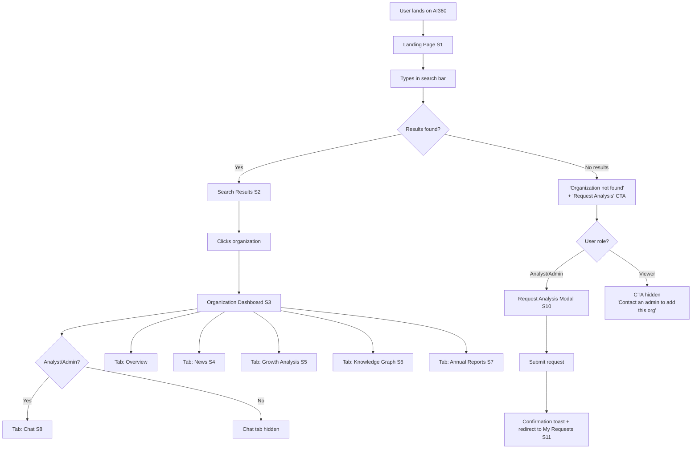
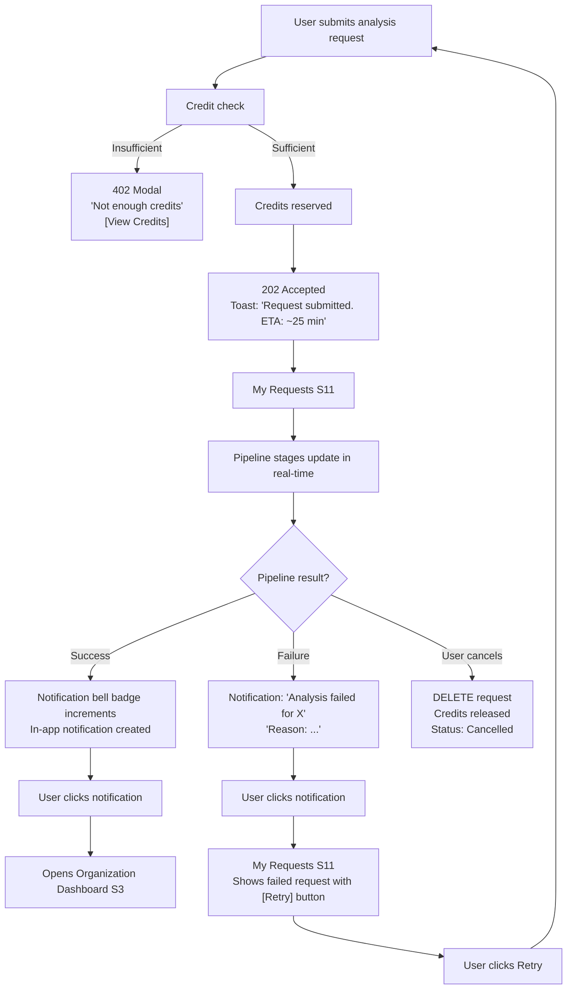
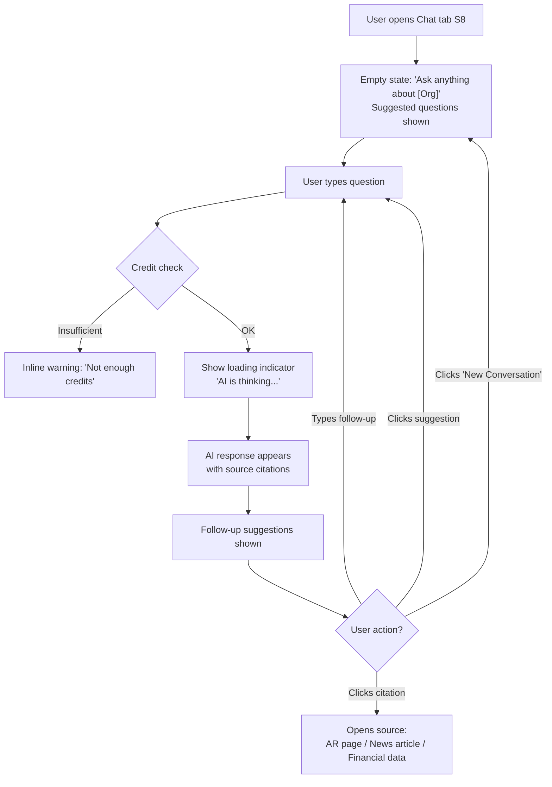
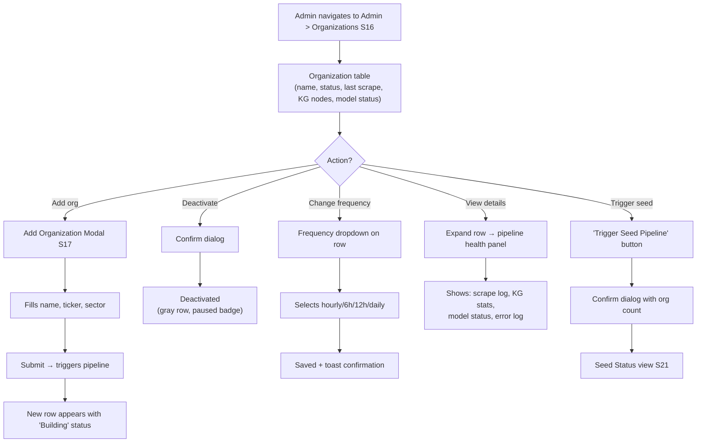
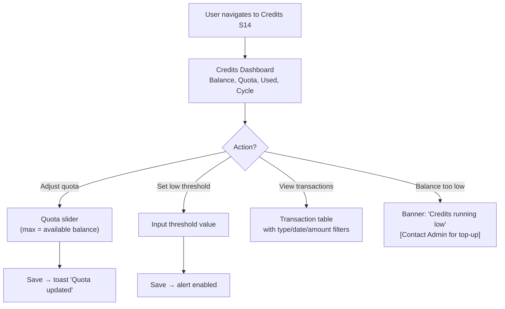
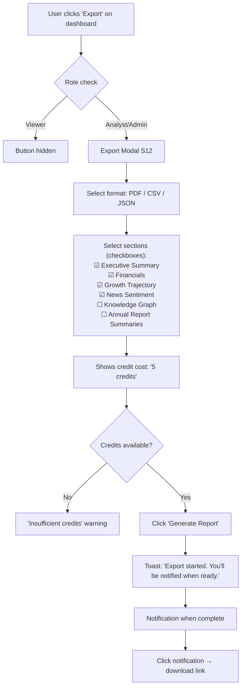
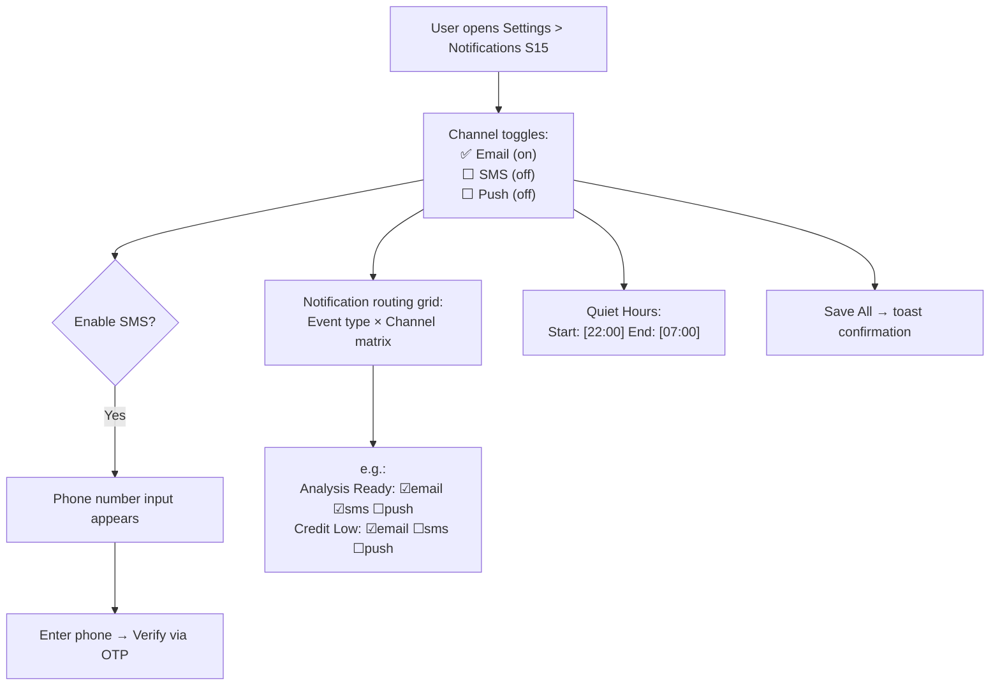

# AI360 — UI/UX Specification

**Version:** 1.0
**Author:** Nitin Agarwal
**Last Updated:** 2026-03-18
**Status:** Draft

> Prototypes: See `prototypes/` directory for working HTML/Tailwind mockups.

---

## Table of Contents

1. [Design System](#1-design-system)
2. [Navigation & Layout](#2-navigation--layout)
3. [Screen Inventory](#3-screen-inventory)
4. [Component Inventory](#4-component-inventory)
5. [User Flow Diagrams](#5-user-flow-diagrams)
6. [Role-Aware UI Behavior](#6-role-aware-ui-behavior)
7. [Responsive Design](#7-responsive-design)
8. [Accessibility](#8-accessibility)
9. [Prototype Index](#9-prototype-index)

---

## 1. Design System

### 1.1 Color Palette

| Token | Hex | Usage |
|-------|-----|-------|
| **Primary** | `#4F46E5` (Indigo-600) | Primary buttons, links, active nav, focus rings |
| **Primary Hover** | `#4338CA` (Indigo-700) | Button hover, link hover |
| **Primary Light** | `#EEF2FF` (Indigo-50) | Selected row, active tab background |
| **Background** | `#F8FAFC` (Slate-50) | Page background |
| **Surface** | `#FFFFFF` | Cards, modals, panels |
| **Border** | `#E2E8F0` (Slate-200) | Card borders, dividers, input borders |
| **Text Primary** | `#0F172A` (Slate-900) | Headings, body text |
| **Text Secondary** | `#64748B` (Slate-500) | Descriptions, metadata, timestamps |
| **Text Muted** | `#94A3B8` (Slate-400) | Placeholders, disabled text |
| **Success** | `#10B981` (Emerald-500) | Positive sentiment, active status, positive change |
| **Success Background** | `#ECFDF5` (Emerald-50) | Success badge background |
| **Warning** | `#F59E0B` (Amber-500) | Neutral sentiment, pending status, warnings |
| **Warning Background** | `#FFFBEB` (Amber-50) | Warning badge background |
| **Danger** | `#EF4444` (Red-500) | Negative sentiment, errors, failed status, negative change |
| **Danger Background** | `#FEF2F2` (Red-50) | Error badge background |
| **Info** | `#3B82F6` (Blue-500) | Informational badges, links |

### 1.2 Typography

| Element | Font | Weight | Size | Line Height |
|---------|------|--------|------|-------------|
| Page title | Inter | 700 (Bold) | 24px / `text-2xl` | 32px |
| Section heading | Inter | 600 (Semibold) | 20px / `text-xl` | 28px |
| Card heading | Inter | 600 | 16px / `text-base` | 24px |
| Body text | Inter | 400 (Regular) | 14px / `text-sm` | 20px |
| Small text / metadata | Inter | 400 | 12px / `text-xs` | 16px |
| Button text | Inter | 500 (Medium) | 14px / `text-sm` | 20px |
| Badge text | Inter | 500 | 12px / `text-xs` | 16px |
| Monospace (code/tickers) | JetBrains Mono | 400 | 13px | 20px |

### 1.3 Spacing Scale

Follows Tailwind's 4px base: `4px (1)`, `8px (2)`, `12px (3)`, `16px (4)`, `20px (5)`, `24px (6)`, `32px (8)`, `40px (10)`, `48px (12)`, `64px (16)`.

| Context | Spacing |
|---------|---------|
| Page padding (horizontal) | 24px (`px-6`) on desktop; 16px (`px-4`) on mobile |
| Card padding | 24px (`p-6`) |
| Card gap (grid) | 24px (`gap-6`) |
| Section margin (vertical) | 32px (`mb-8`) |
| Form field gap | 16px (`space-y-4`) |
| Inline element gap | 8px (`gap-2`) |

### 1.4 Elevation & Borders

| Element | Style |
|---------|-------|
| Card | `bg-white rounded-xl border border-slate-200 shadow-sm` |
| Elevated card (hover) | Add `shadow-md` on hover with `transition-shadow` |
| Modal overlay | `bg-black/50 backdrop-blur-sm` |
| Modal content | `bg-white rounded-2xl shadow-2xl` |
| Dropdown | `bg-white rounded-lg shadow-lg border border-slate-200` |
| Input field | `rounded-lg border border-slate-300 focus:ring-2 focus:ring-indigo-500 focus:border-indigo-500` |
| Badge | `rounded-full px-2.5 py-0.5 text-xs font-medium` |

### 1.5 Iconography

Use **Heroicons** (outline style, 20px for inline, 24px for nav). Key icons:

| Context | Icon |
|---------|------|
| Search | `magnifying-glass` |
| Dashboard | `squares-2x2` |
| News | `newspaper` |
| Graph | `share` (or `circle-stack`) |
| Chat | `chat-bubble-left-right` |
| Notifications | `bell` |
| Credits | `credit-card` |
| Settings | `cog-6-tooth` |
| Users | `users` |
| Export | `arrow-down-tray` |
| External link | `arrow-top-right-on-square` |
| Positive trend | `arrow-trending-up` |
| Negative trend | `arrow-trending-down` |
| Filter | `funnel` |
| Refresh | `arrow-path` |
| Close | `x-mark` |
| Check | `check` |
| Warning | `exclamation-triangle` |
| Info | `information-circle` |

---

## 2. Navigation & Layout

### 2.1 Shell Layout

```
┌──────────────────────────────────────────────────────┐
│  TOP BAR (h-16, fixed)                               │
│  [Logo] [Search Bar (center)] [Notif] [Credits] [Av] │
├───────────┬──────────────────────────────────────────┤
│  SIDEBAR  │  MAIN CONTENT AREA                       │
│  (w-64,   │  (scrollable, bg-slate-50)               │
│  fixed,   │                                          │
│  bg-white)│  ┌─ Breadcrumb ─────────────────────┐   │
│           │  │                                    │   │
│  [Nav]    │  │  Page Content                     │   │
│           │  │  (max-w-7xl mx-auto)              │   │
│           │  │                                    │   │
│           │  └────────────────────────────────────┘   │
│           │                                          │
└───────────┴──────────────────────────────────────────┘
```

### 2.2 Top Bar

- **Left:** AI360 logo + wordmark
- **Center:** Global search bar (always visible, `w-96`)
- **Right:** Notification bell (with unread badge), credit balance chip, user avatar dropdown (profile, settings, sign out)

### 2.3 Sidebar Navigation

The sidebar is collapsible on smaller screens. Items are grouped:

**Main:**
- Search (home/landing)
- My Requests (Analyst/Admin only)
- Compare Organizations (Analyst/Admin only)

**Admin** (Admin role only):
- Organizations
- Users & Roles
- Platform Settings
- Data Sources
- Seed Pipeline
- Credit Pricing

**User:**
- Credits & Billing
- Notification Preferences
- Profile

The active nav item is highlighted with `bg-indigo-50 text-indigo-700 border-r-2 border-indigo-600`.

### 2.4 Organization Context

When viewing an organization's 360 profile, a **secondary tab bar** appears below the breadcrumb:

```
[Overview] [News] [Growth Analysis] [Knowledge Graph] [Annual Reports] [Chat (Analyst+)]
```

This tabs the main content area between organization sub-views. The organization name + ticker appear in the breadcrumb.

---

## 3. Screen Inventory

### 3.1 Screen Map

| # | Screen | URL Pattern | Access |
|---|--------|-------------|--------|
| S1 | Landing / Search | `/` | All roles |
| S2 | Search Results | `/search?q=...` | All roles |
| S3 | Organization Dashboard (Overview) | `/org/:id` | All roles |
| S4 | Organization — News | `/org/:id/news` | All roles |
| S5 | Organization — Growth Analysis | `/org/:id/analysis` | All roles |
| S6 | Organization — Knowledge Graph | `/org/:id/graph` | All roles |
| S7 | Organization — Annual Reports | `/org/:id/annual-reports` | All roles |
| S8 | Organization — Chat | `/org/:id/chat` | Analyst, Admin |
| S9 | Compare Organizations | `/compare` | Analyst, Admin |
| S10 | Submit Analysis Request (modal) | overlay on S2 | Analyst, Admin |
| S11 | My Requests | `/requests` | Analyst, Admin |
| S12 | Export (modal) | overlay on S3 | Analyst, Admin |
| S13 | Notification Center (panel) | slide-over from top bar | All roles |
| S14 | Credits Dashboard | `/credits` | All roles |
| S15 | Notification Preferences | `/settings/notifications` | All roles |
| S16 | Admin — Organizations | `/admin/organizations` | Admin |
| S17 | Admin — Add Organization (modal) | overlay on S16 | Admin |
| S18 | Admin — Users & Roles | `/admin/users` | Admin |
| S19 | Admin — Platform Settings | `/admin/settings` | Admin |
| S20 | Admin — Data Sources | `/admin/data-sources` | Admin |
| S21 | Admin — Seed Pipeline | `/admin/seed` | Admin |
| S22 | Admin — Credit Pricing | `/admin/pricing` | Admin |

### 3.2 Screen Descriptions

#### S1: Landing / Search

The hero screen. Centered layout with:
- Large AI360 logo at top
- Prominent search bar with placeholder "Search organizations by name or ticker..."
- Below search: horizontal row of **recently viewed orgs** (if any) as small cards
- Below that: **trending organizations** grid (4 seed org cards showing name, sector, sentiment gauge, share price)
- Footer note: "Tracking 500+ organizations with AI-powered insights"

#### S3: Organization Dashboard (Overview)

The primary dashboard. Layout:

```
┌─ Org Header ─────────────────────────────────────────┐
│ [Logo] Name · Ticker · Sector · HQ                   │
│ [Export btn] [Refresh btn] Last updated: 5m ago       │
├──────────────────────────────────────────────────────┤
│ [Overview] [News] [Analysis] [Graph] [AR] [Chat]     │
├───────────────────┬──────────────────────────────────┤
│ Financial Card    │ Sentiment Card                   │
│ Share: ₹2,845     │ ██████░░░░                       │
│ ▲ +2.3% today     │ 65% Positive · 25% Neutral       │
│ MCap: ₹19.2T     │ Based on 142 articles            │
│ Rev: ₹9.8T       │                                  │
├───────────────────┼──────────────────────────────────┤
│ Share Price Chart (line chart, 1M/3M/6M/1Y/3Y tabs)  │
├───────────────────┬──────────────────────────────────┤
│ Future Plans      │ Knowledge Base Health             │
│ • AI summary of   │ 347 entities · 892 relationships │
│   strategic init.  │ 1,204 embeddings                │
│ • Key priorities   │ AI Model: Ready ✓               │
│                    │ Last enriched: 2h ago            │
└───────────────────┴──────────────────────────────────┘
```

#### S8: Chat Interface

Full-height chat view within the organization context:

```
┌─ Chat Header ──────────────────────────────────────┐
│ AI Q&A — Reliance Industries      [New Conversation] │
├────────────────────────────────────────────────────┤
│                                                    │
│  (Message bubbles)                                 │
│                                                    │
│  User: "What were the key strategic initiatives    │
│         in FY2025?"                                │
│                                                    │
│  AI: "Based on the Annual Report 2024-25,          │
│       Reliance's key strategic initiatives..."     │
│       [📄 AR 2024-25, p.42] [📰 ET, Mar 2026]    │
│                                                    │
│  Suggested: "How has revenue changed?" |           │
│             "What are the main risks?"             │
│                                                    │
├────────────────────────────────────────────────────┤
│  [💬 Type your question...]           [Send ▶]    │
│  1 credit per question                             │
└────────────────────────────────────────────────────┘
```

#### S14: Credits Dashboard

```
┌─ Credit Summary Cards ───────────────────────────────┐
│ ┌──────────┐ ┌──────────┐ ┌──────────┐ ┌──────────┐ │
│ │ Balance  │ │ Quota    │ │ Used     │ │ Cycle    │ │
│ │ 847      │ │ 500/mo   │ │ 312 used │ │ Resets   │ │
│ │ credits  │ │ limit    │ │ this mo  │ │ Apr 1    │ │
│ └──────────┘ └──────────┘ └──────────┘ └──────────┘ │
├──────────────────────────────────────────────────────┤
│ Quota Settings                                       │
│ [━━━━━━━━━━━━━━━━━━○━━━━━━] 500 / 847 available     │
│ Low credit alert at: [100] credits                   │
├──────────────────────────────────────────────────────┤
│ Transaction History                                  │
│ ┌────────┬──────────┬────────┬─────────┬───────────┐│
│ │ Date   │ Action   │ Amount │ Balance │ Reference ││
│ ├────────┼──────────┼────────┼─────────┼───────────┤│
│ │ Mar 18 │ AI Query │ -1     │ 847     │ Chat:Rel. ││
│ │ Mar 18 │ Export   │ -5     │ 848     │ PDF:TCS   ││
│ │ Mar 17 │ Analysis │ -25    │ 853     │ Req:Wipro ││
│ │ Mar 15 │ Purchase │ +500   │ 878     │ Admin     ││
│ └────────┴──────────┴────────┴─────────┴───────────┘│
└──────────────────────────────────────────────────────┘
```

---

## 4. Component Inventory

### 4.1 Core Components

| Component | Description | Variants |
|-----------|-------------|----------|
| `SearchBar` | Global search input with autocomplete dropdown | Hero (large, centered), Topbar (compact) |
| `OrgCard` | Organization summary card (name, sector, sentiment, price) | Grid (square), List row, Compact (comparison) |
| `StatCard` | Metric display with label, value, trend indicator | Default, Large, Mini |
| `SentimentBadge` | Colored pill showing sentiment | `positive` (green), `neutral` (amber), `negative` (red) |
| `StatusBadge` | Pipeline/model status indicator | `ready` (green), `building` (blue pulse), `failed` (red), `queued` (gray) |
| `RoleBadge` | User role pill | `admin` (purple), `analyst` (blue), `viewer` (gray) |
| `CreditChip` | Credit balance shown in top bar | Shows icon + balance; amber when low |
| `NotificationBell` | Bell icon with unread count badge | Default, Has-unread (red dot + count) |
| `DataTable` | Sortable, filterable, paginated table | With/without row selection, expandable rows |
| `FilterBar` | Horizontal row of filter controls | Chips, dropdowns, date range picker |
| `Tabs` | Tab bar for organization sub-views | Default (underline), Pill |
| `Modal` | Centered overlay dialog | Small (400px), Medium (560px), Large (720px) |
| `SlideOver` | Right-side panel (notification center) | Default (w-96) |
| `ProgressBar` | Pipeline stage progress | Stepped (with labels), Linear |
| `ChatBubble` | Message in chat interface | User (right, indigo bg), AI (left, white bg) |
| `CitationChip` | Clickable source reference in AI response | Annual Report, News, Financial |
| `EmptyState` | Placeholder for no-data screens | With illustration, action button |
| `ConfirmDialog` | Destructive action confirmation | Delete, Deactivate, Cancel request |

### 4.2 Chart Components

| Component | Library | Usage |
|-----------|---------|-------|
| `SharePriceChart` | Recharts (LineChart) | Historical price with period selector |
| `SentimentDonut` | Recharts (PieChart) | Positive/neutral/negative distribution |
| `GrowthTrajectoryChart` | Recharts (AreaChart) | Revenue projection with confidence bands |
| `ComparisonOverlay` | Recharts (LineChart) | Multi-org price overlay |
| `KnowledgeGraphViz` | react-force-graph-2d | Interactive force-directed graph |
| `PipelineStageTimeline` | Custom SVG | Step-by-step pipeline progress |

---

## 5. User Flow Diagrams

### 5.1 Search → Dashboard Flow



### 5.2 Analysis Request & Notification Flow



### 5.3 Chat Conversation Flow



### 5.4 Admin Organization Management Flow



### 5.5 Credits & Quota Management Flow



### 5.6 Export Flow



### 5.7 Notification Preferences Flow



---

## 6. Role-Aware UI Behavior

### 6.1 Visibility Matrix

| UI Element | Admin | Analyst | Viewer |
|------------|:-----:|:-------:|:------:|
| Search bar | Visible | Visible | Visible |
| Organization dashboard tabs (all) | Visible | Visible | Visible |
| Chat tab | Visible | Visible | **Hidden** |
| "Export" button on dashboard | Visible | Visible | **Hidden** |
| "Request Analysis" CTA on search miss | Visible | Visible | **Hidden** |
| "Refresh Analysis" button | Visible | Visible | **Hidden** |
| "Compare" in sidebar | Visible | Visible | **Hidden** |
| "My Requests" in sidebar | Visible | Visible | **Hidden** |
| Credit balance in top bar | Visible | Visible | Visible (read-only) |
| **Admin section in sidebar** | **Visible** | **Hidden** | **Hidden** |
| Admin: Organizations | Visible | Hidden | Hidden |
| Admin: Users & Roles | Visible | Hidden | Hidden |
| Admin: Platform Settings | Visible | Hidden | Hidden |
| Admin: Data Sources | Visible | Hidden | Hidden |
| Admin: Seed Pipeline | Visible | Hidden | Hidden |
| Admin: Credit Pricing | Visible | Hidden | Hidden |

### 6.2 Behavior on Unauthorized Access

- If a Viewer manually navigates to `/compare` → redirect to `/` with toast "You don't have permission to access this page."
- If a non-Admin navigates to `/admin/*` → redirect to `/` with the same toast.
- API-level 403 responses show an inline error: "Access denied. Contact your admin for role upgrade."

---

## 7. Responsive Design

### 7.1 Breakpoints

| Breakpoint | Width | Layout Change |
|------------|-------|---------------|
| `sm` | 640px | Single column; sidebar collapses to hamburger |
| `md` | 768px | Two-column cards; sidebar still collapsed |
| `lg` | 1024px | Sidebar visible; full layout |
| `xl` | 1280px | Wider content area; 3-column card grids |
| `2xl` | 1536px | Max-width container; centered |

### 7.2 Mobile Adaptations (< 1024px)

- Sidebar becomes a slide-out drawer triggered by hamburger icon in top bar
- Search bar collapses to an icon; tapping opens full-width search overlay
- Organization dashboard cards stack vertically (single column)
- Data tables become horizontally scrollable with sticky first column
- Chat interface takes full height (bottom sheet style on mobile)
- Modals become full-screen on mobile

---

## 8. Accessibility

- All interactive elements have visible focus rings (`ring-2 ring-indigo-500 ring-offset-2`)
- Color is never the sole indicator (sentiment badges include text label, not just color)
- All images/icons have `aria-label` or `alt` text
- Data tables use proper `<th scope="col">` and `<th scope="row">`
- Modals trap focus and close on Escape
- Minimum touch targets: 44×44px on mobile
- WCAG 2.1 AA contrast ratios (4.5:1 for body text, 3:1 for large text)
- Screen reader announcements for toast notifications and status changes

---

## 9. Prototype Index

| File | Screen | Description |
|------|--------|-------------|
| `prototypes/search.html` | S1, S2, S10 | Landing page, search results, request analysis modal |
| `prototypes/dashboard.html` | S3, S4, S5, S7, S8, S12, S13 | Full org dashboard with all tabs, chat, export modal, notifications |
| `prototypes/admin.html` | S16, S17, S18, S19, S20 | Admin panel with org management, users, settings, data sources |
| `prototypes/credits.html` | S14, S15, S11 | Credits dashboard, notification preferences, my requests |

Open each `.html` file directly in a browser — all are self-contained with Tailwind CSS via CDN.

---

## Changelog

| Date | Author | Change |
|------|--------|--------|
| 2026-03-18 | Nitin Agarwal | Initial UI/UX specification with design system, screen inventory, component inventory, user flow diagrams, role-aware behavior, and responsive design guidelines |
